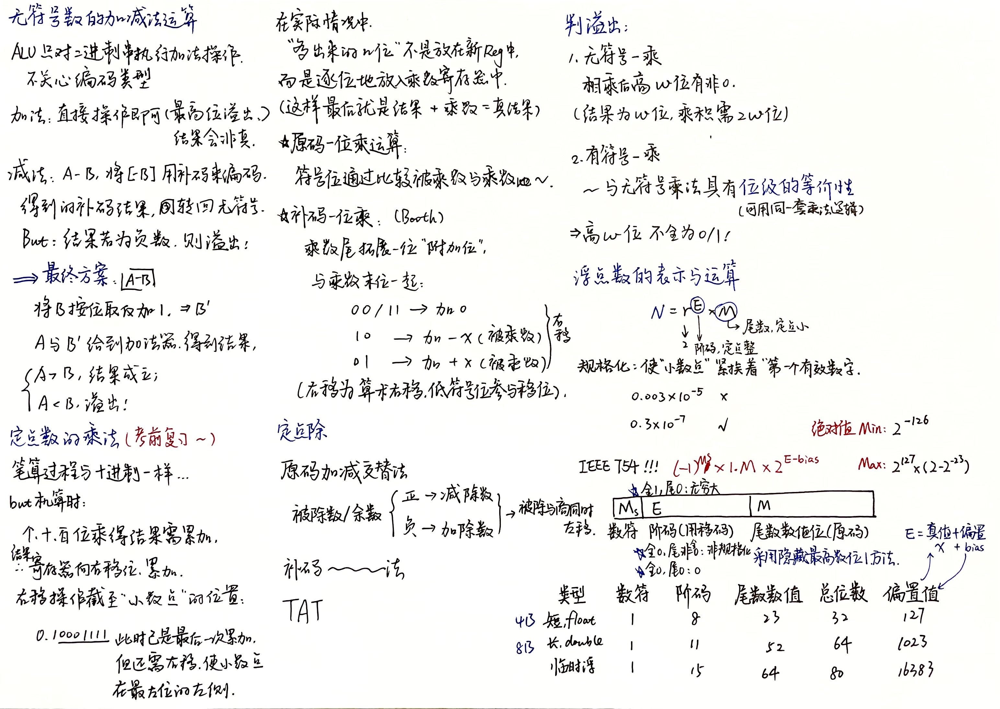
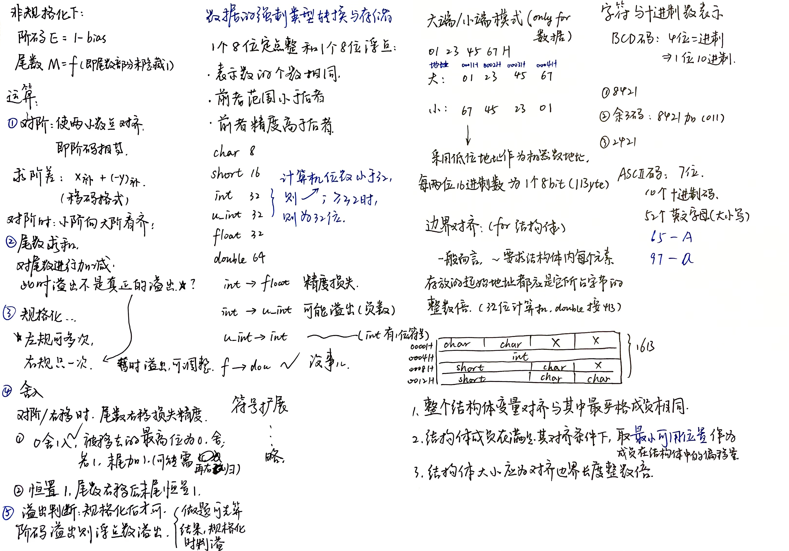

# 计算机组成原理

## 1. 绪论

??? note "2024-04-06 绪论"

    
    

??? tip "错题整理"

## 2. 数据的表示与运算

??? note "2024-05-01 逻辑运算、进制与定点数加减"

    
    

??? note "2024-05-12 无符号加减、定点数乘除、浮点数、数据强制类型、大小端、边界对齐"

    
    

??? tip "错题整理"

<!---

## 3. 储存器

??? note "笔记"

??? note "笔记"

??? note "笔记"

??? tip "错题整理"

## 4. 指令系统

??? note "笔记"

??? tip "错题整理"

## 5. 总线

??? note "笔记"

??? tip "错题整理"

## 6. CPU

??? note "笔记"

??? tip "错题整理"

## 7. CU与ALU

??? note "笔记"

??? tip "错题整理"

## 8. IO

??? note "笔记"

??? tip "错题整理"

--->
