# 数据结构

## 1. 绪论与线性表

??? note "2022-03-02 绪论与线性表"

    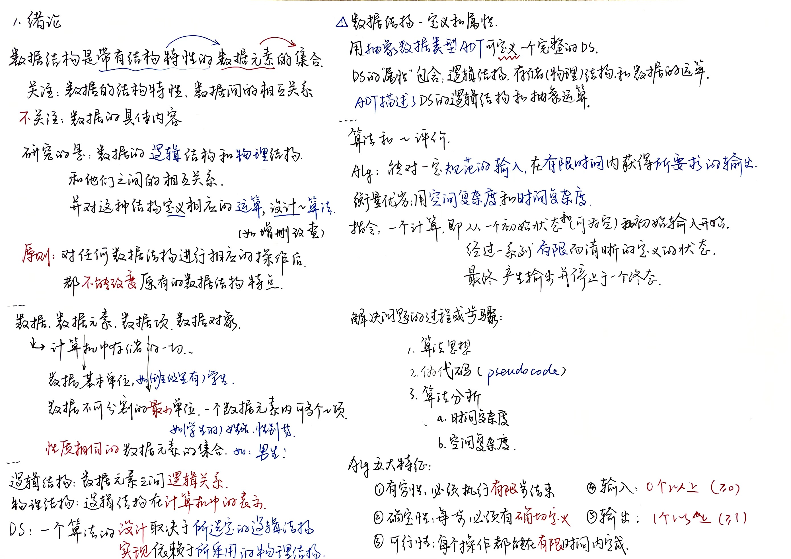
    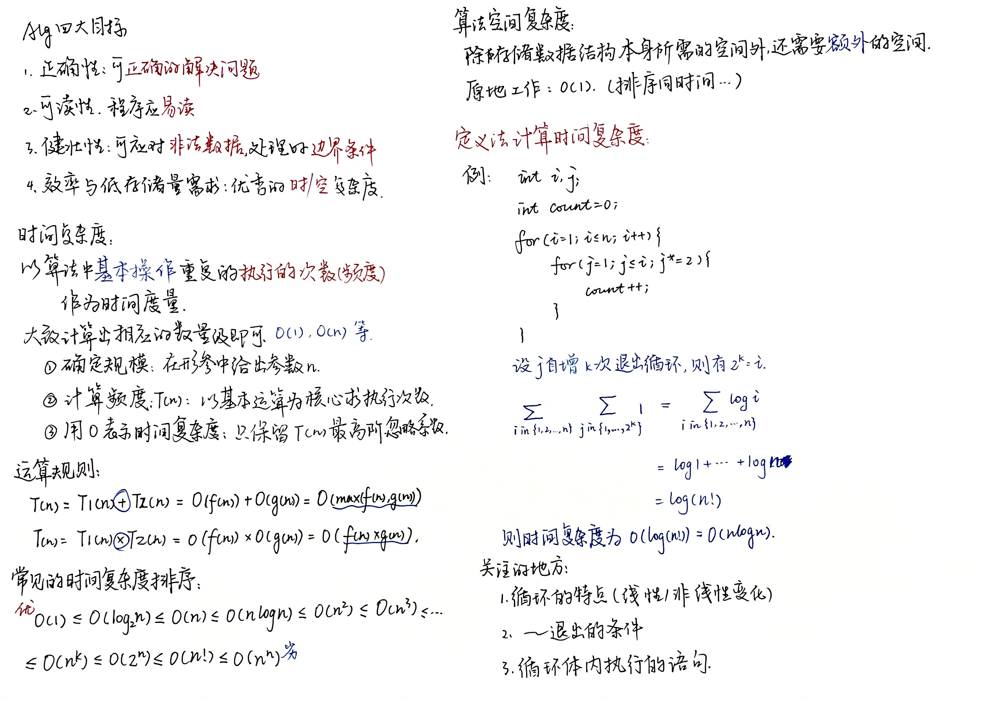
    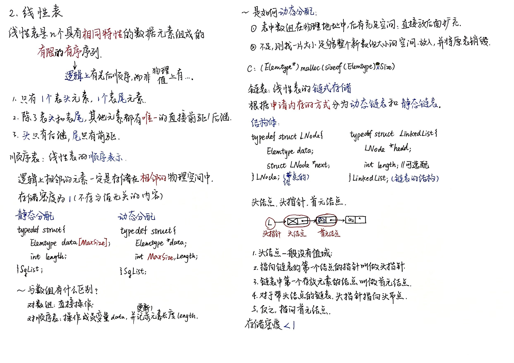
    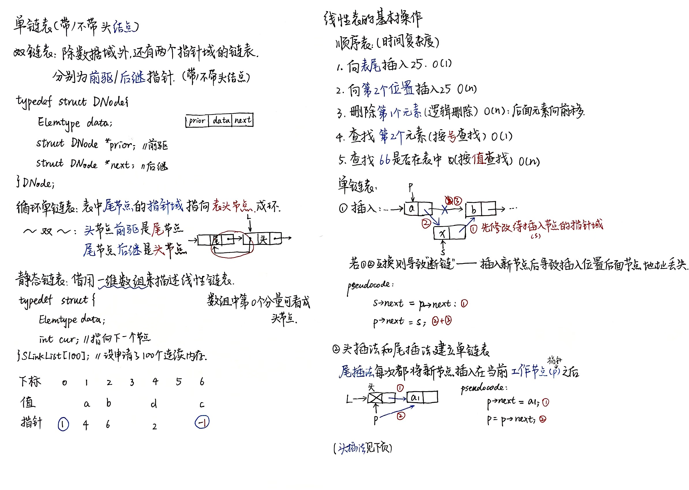
    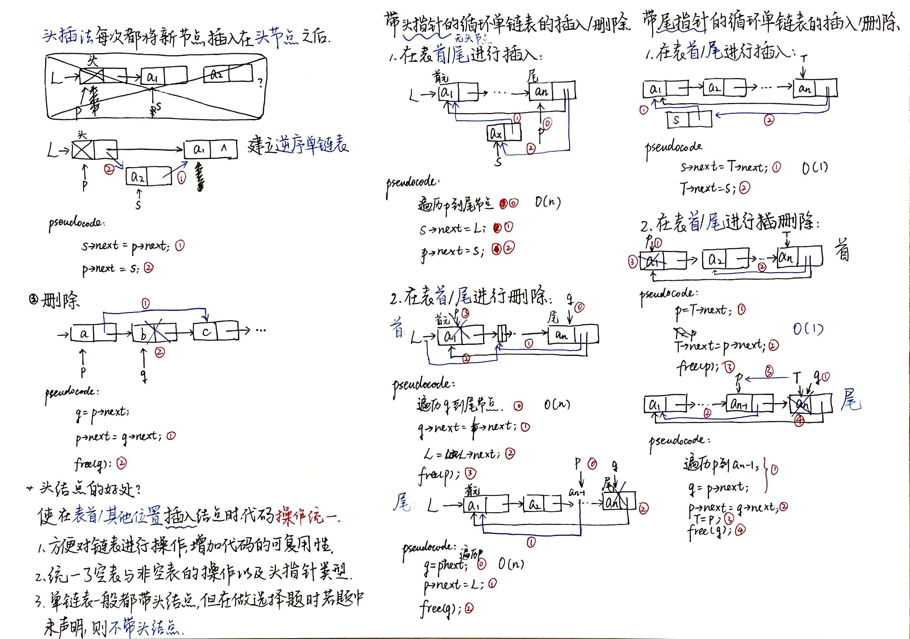
    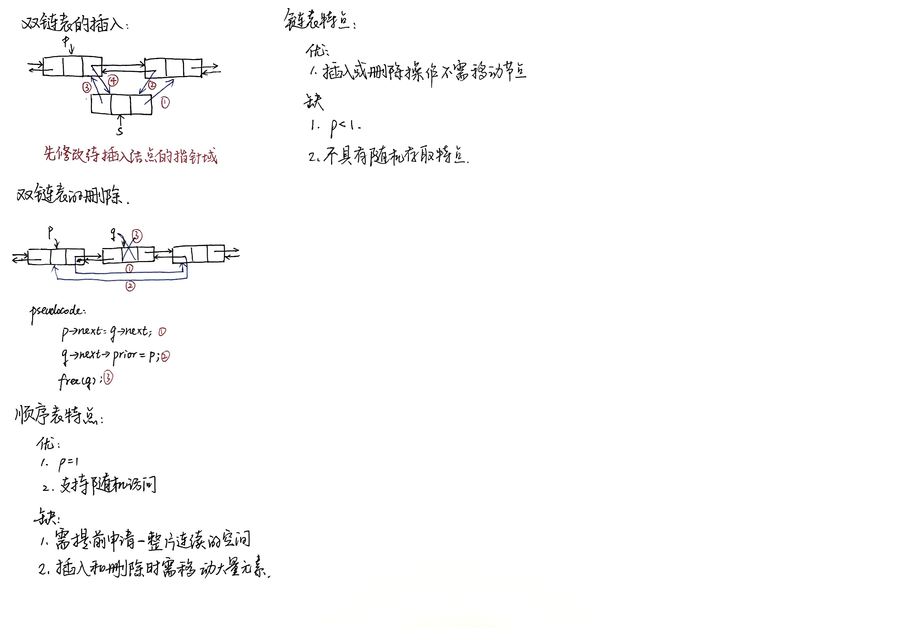

??? tip "错题整理"

## 2. 栈、队列与矩阵

??? note "2022-03-03 栈&队列&矩阵&串"

    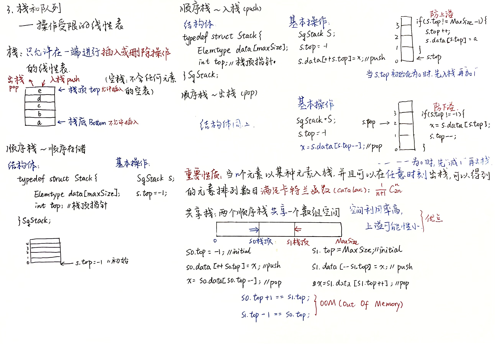
    
    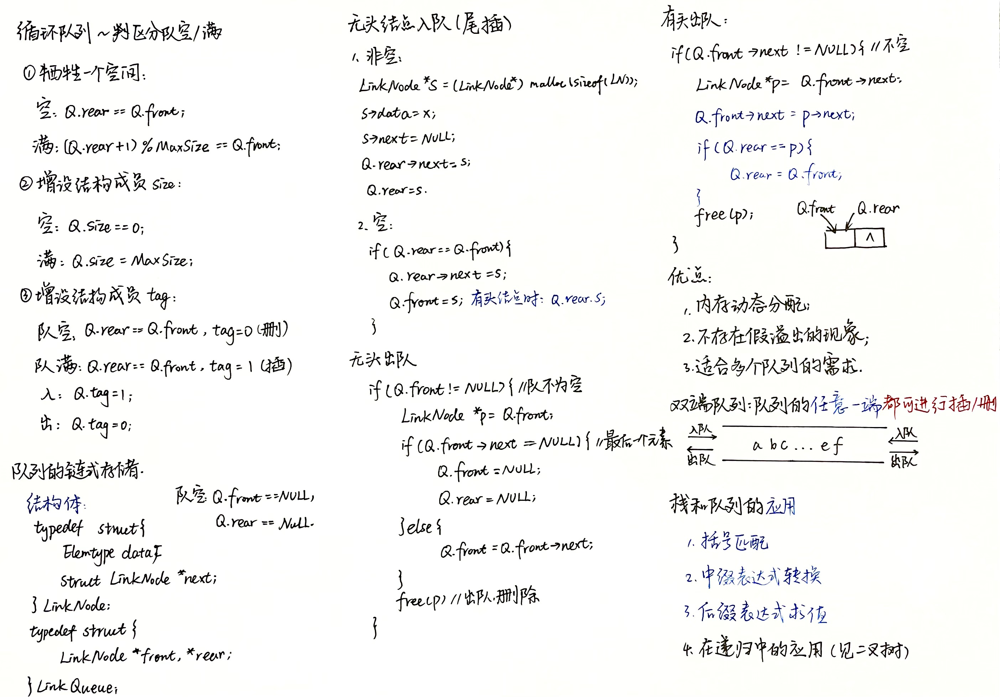
    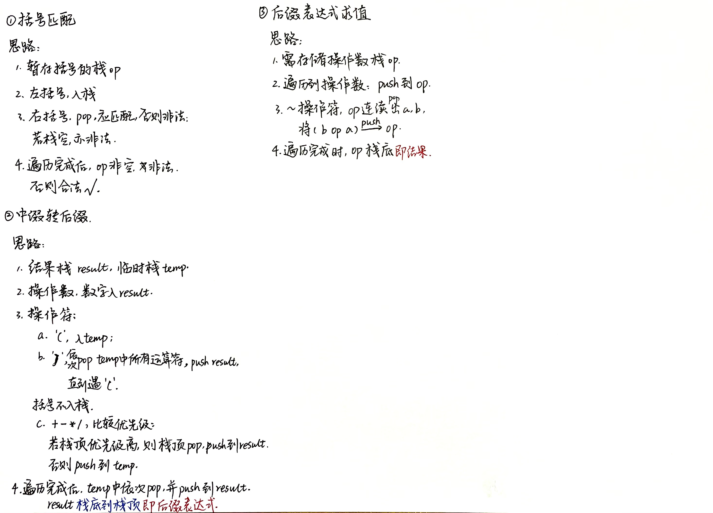
    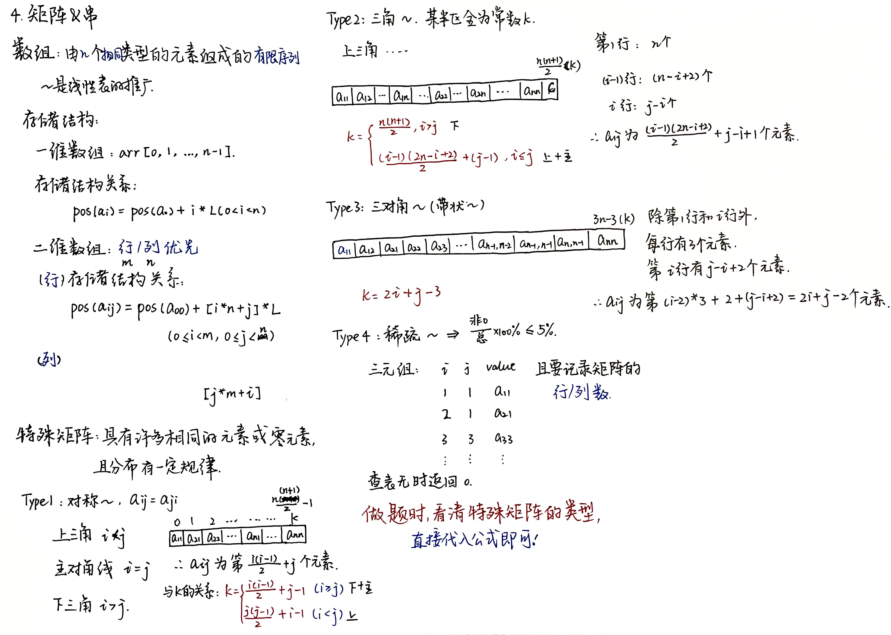
    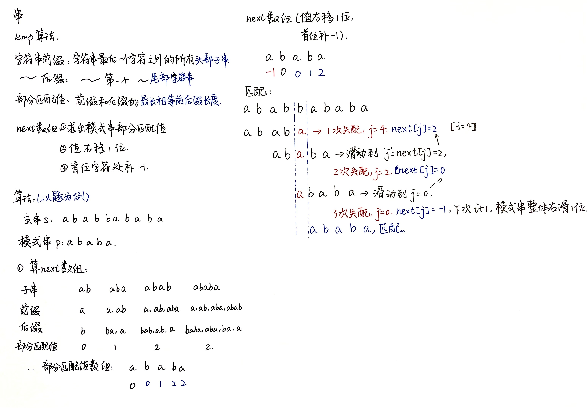
    

??? tip "错题整理"

## 3. 树与二叉树

??? note "2022-03-04 树&二叉树"

    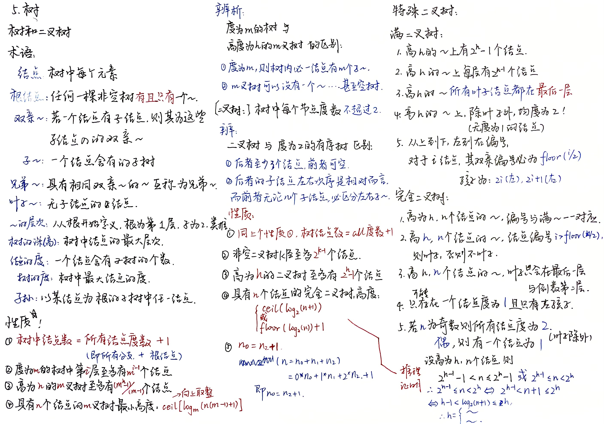
    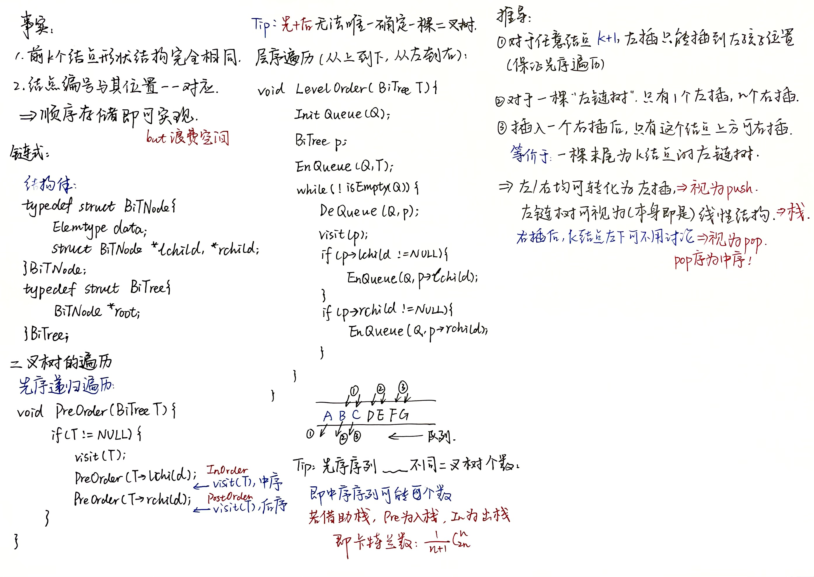

??? tip "错题整理"

<!---

## 4. 树的应用与图的基础

??? note "笔记"

??? tip "错题整理"

## 5. 图的遍历和应用

??? note "笔记"

??? tip "错题整理"

## 6. 图

??? note "笔记"

??? tip "错题整理"

## 7. 查找

??? note "笔记"

??? tip "错题整理"

## 8. 排序

??? note "笔记"

??? tip "错题整理"

## 9. 红黑树

??? note "笔记"

??? tip "错题整理"

## 10. KMP算法

??? note "笔记"

??? tip "错题整理"

--->
