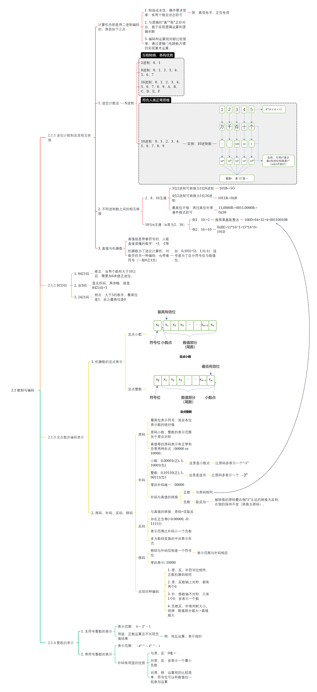

# 2.1 数制与编码

> 本章节重难点：
>
> 1. 符号位
> 3. 原转补的方法
> 4. 各种编码的特征与区别（表格）

## 1. 符号位

**定点整数和定点小数的 `符号位` 与 `数值部分` 应当分开来看，转换时单独运算。**

**补码与移码的区别**

关于 `0`：我们可以看到，`0` 无论在补码还是移码中，其符号位都是正，那么我们需要注意：

```
00000000	// 8位补码
10000000	// 8位移码
```

其余的数字我们只需要改变一下符号位（两种编码符号位相反）即可。

## 2. 原转补的方法

**最低的 `1` 的位和比它低的 `0`的位**保持不变，**符号位**保持不变，其余取反。

举个例子：（ `x` 表示不变的位）

| 十进制：-1                         | 十进制：-2                         |
| ---------------------------------- | ---------------------------------- |
| **`1`**111111**`1`**	// 8位补码 | **`1`**11111**`10`**	// 8位补码 |
| **`1`**000000**`1`**	// 8位原码 | **`1`**00000**`10`**	// 8位原码 |

## 3. 各种整数编码的特征与区别（表格）

|            |          | 0                               | 特点                        |
| ---------- | -------- | ------------------------------- | --------------------------- |
| 无符号整数 | 0-255    | 00000000 // all 0               | 易表示地址                  |
| 原码       | -127~127 | **0**0000000 或 **1**0000000    |                             |
| 反码       | -127~127 | **0**0000000 或 **1**1111111    |                             |
| 补码       | -128~127 | **0**0000000 // all 0           | 易运算/0唯一/多表示负数/... |
| 移码       | -128~127 | **1**0000000 // only sign bit 1 | 符号位与补码相反            |

思维导图如下：


