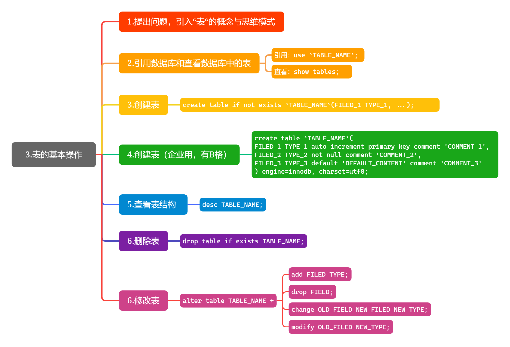

# 03.表的基本操作

> 运行环境：VMware -- Ubuntu 20.04 LTS
>
> 笔记源教程： [【付费】MySQL从零到删库跑路（实习能力）教程：三、表的基本操作--MicroFrank](https://www.yuque.com/books/share/ddbdba56-dc9f-4997-9e18-d9e69309d343/cnbmkg) [`购买链接`](https://item.taobao.com/item.htm?spm=a1z10.1-c.w4004-19115282022.7.4fe07608Ag58vY&id=617388485926)

### 思维导图如下：

