# 博客维护教程-文案工作部分

> 撰稿日期：2023-05-17
>
> 结稿日期：2023-05-18
>
> 作者：张浩睿

前置条件：完成[Ubuntu 2204 工作台的搭建](https://smartcarlabtest.github.io/csblog/Ubuntu-WorkSpace/Ubuntu2204-WorkSpace/)，且配置好了科学上网。

## 1. 初始化你的GitHub

### 建立你的GitHub账号

- 建立账号的过程就不具体演示了，网上有详细的教程。

  我找个例子仅供参考：[GitHub注册及基本使用方法 - SMonk的文章 - 知乎](https://zhuanlan.zhihu.com/p/612695018)

### 给自己的账号添加SSH

- 首先我们打开GitHub自己的主页，然后点击右上角自己的头像，下拉菜单，点击 `Settings`

  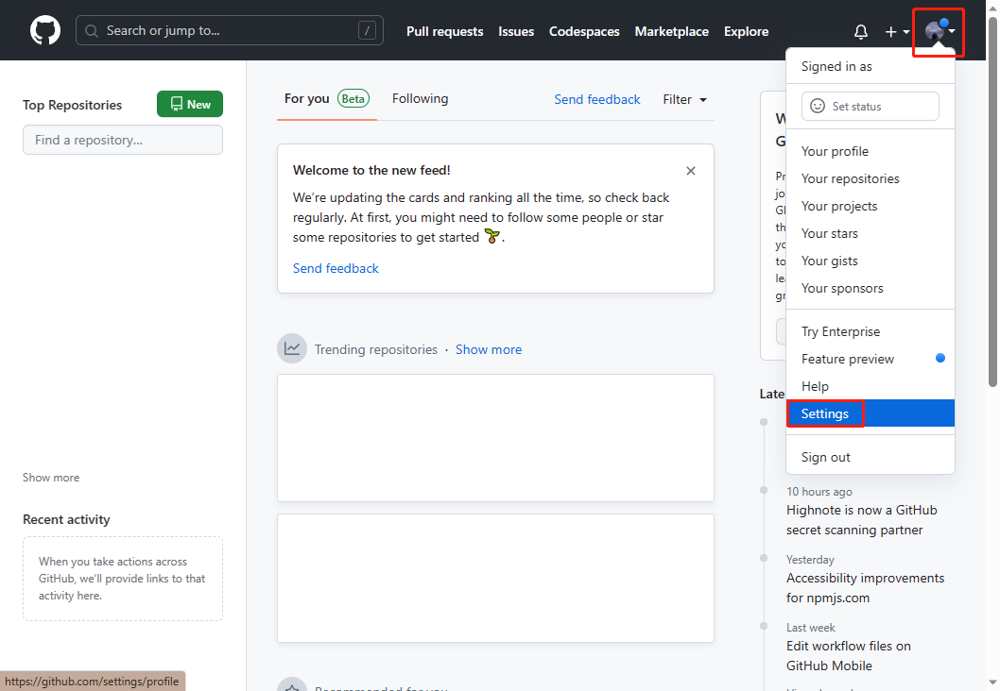

- 之后我们在设置页面点击 `SSH and GPG keys` ，然后点击右上角的 `New SSH key`

  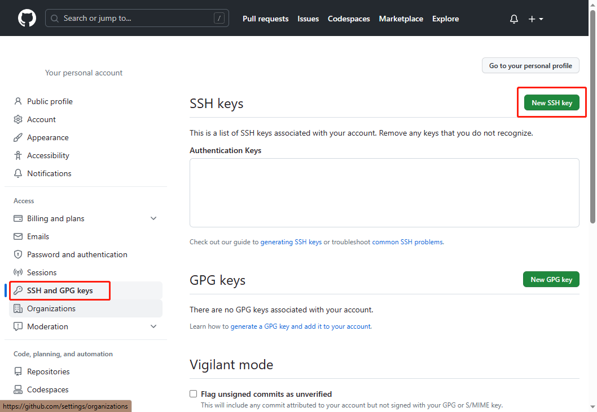

- 此时我们回到我们自己搭建好的虚拟机平台上，打开终端，输入：

  ```bash 
  ssh-keygen -t rsa -C "你注册的GitHub邮箱"
  ```

  之后所需选项全部默认回车或 `yes` 。

  然后我们就可以在 `~/.ssh/id_rsa.pub` 文件内找到我们生成的密钥了。

  命令如下：

  ```bash 
  gedit ~/.ssh/id_rsa.pub
  ```

  回车后就会打开一个文本编辑器，复制其全部内容。

  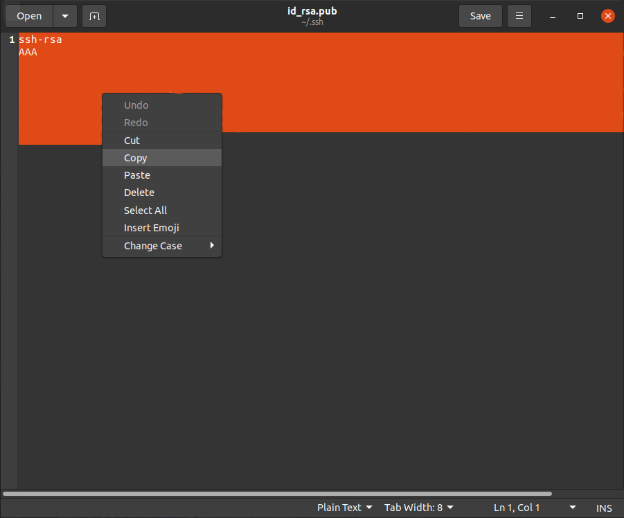

- 我们回到网页，将刚才复制的信息放在 `key` 的输入框内，并在 `Title` 一栏给其起一个名字，最后点 `Add SSH key` ，即添加完成。

  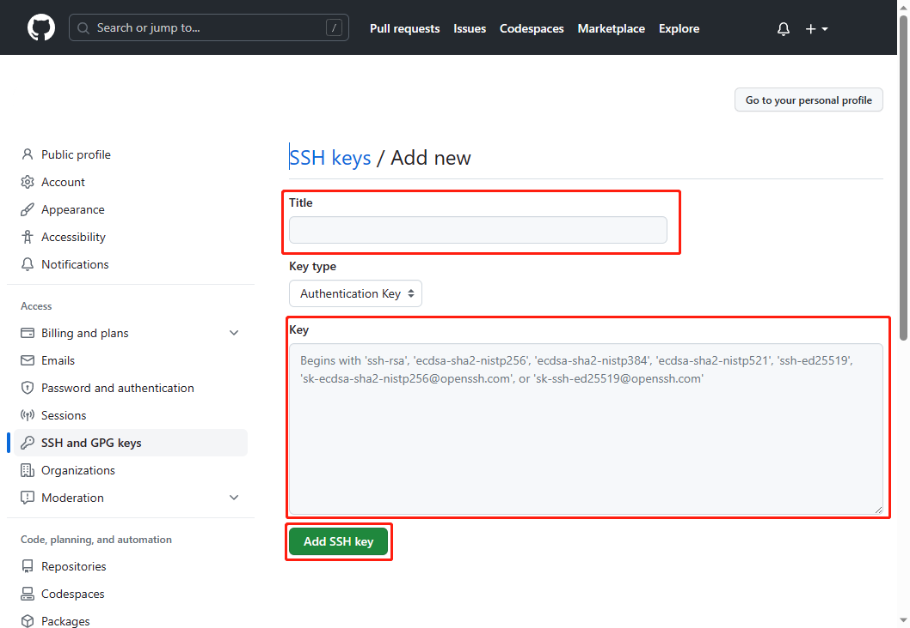

## 2. 克隆远程/部署本地仓库

### 克隆远程仓库

登录 GitHub 后，打开此网址：https://github.com/SmartCarLabTest/smartcarlabtest.github.io

- 点击 `Fork` 

  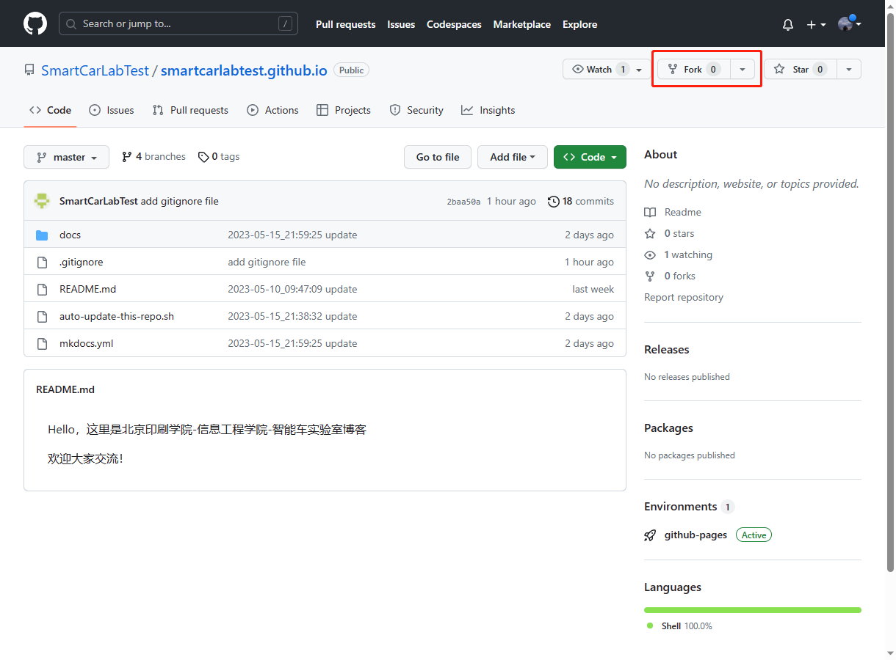

- 直接点击 `Create fork` 

  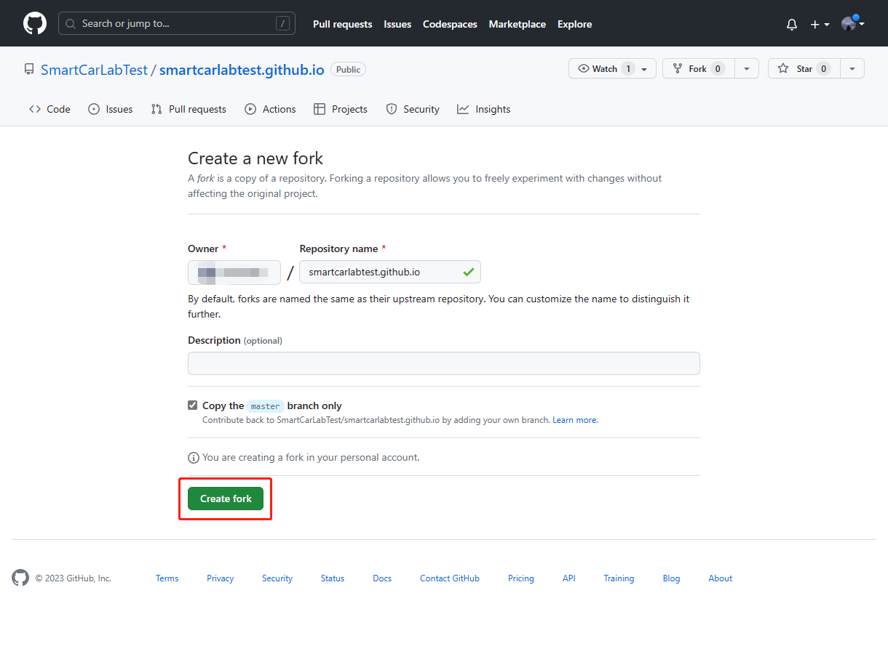

- 接着，页面会跳转到你名下已经 fork 好的仓库里，如下图。

  此时已完成克隆远程仓库，如下图

  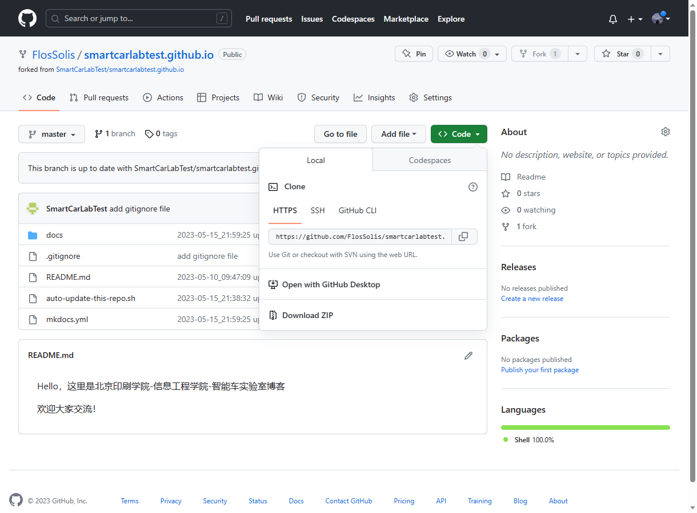


### 部署远程仓库到本地

> 推荐：在 `~/Documents` 文件夹下面进行操作。

（接上文）

- 然后点击 `Code` -> `HTTPS` -> `复制按钮` ，来复制本仓库的链接。

  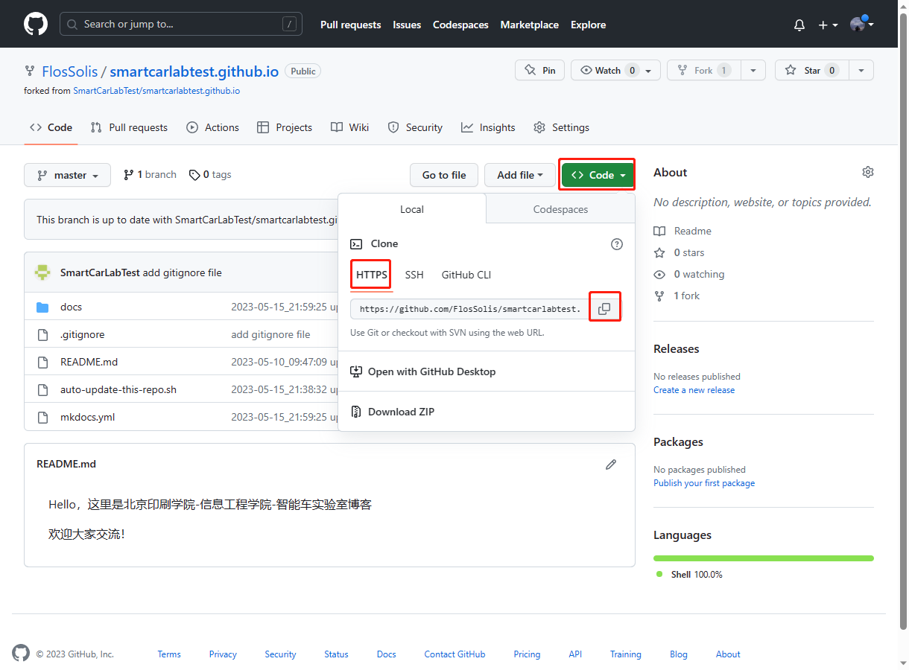

- 我们打开虚拟机，用命令行打开 `~/Documents` 文件夹，输入以下命令来获取远程仓库，如下图：

  ```bash 
  git clone <YOUR_URL>
  ```

  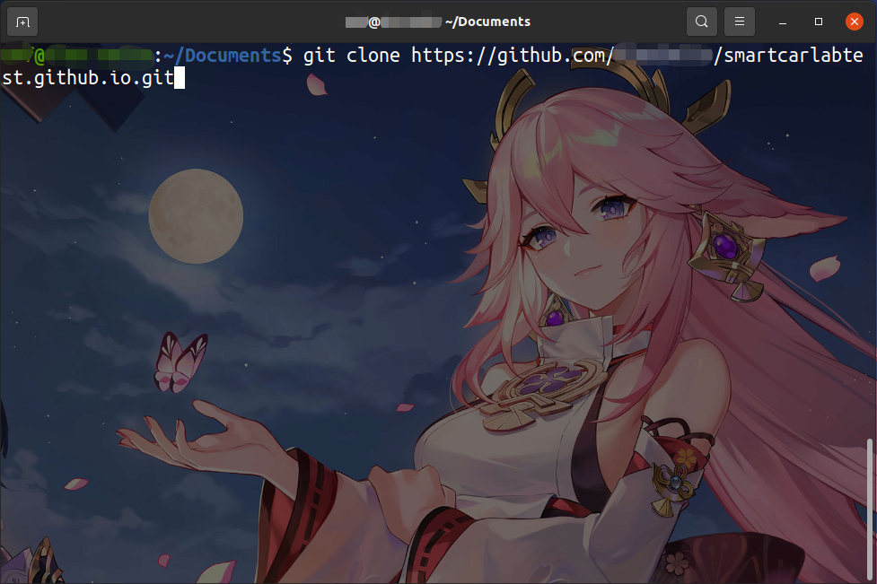

  > 如果 `git clone` 不行的话， 那么就按照以下方法操作：
  >
  > - 打开已经克隆好的远程仓库，点击 `Code` ，然后点击 `SSH` 一栏，复制地址。
  >
  >   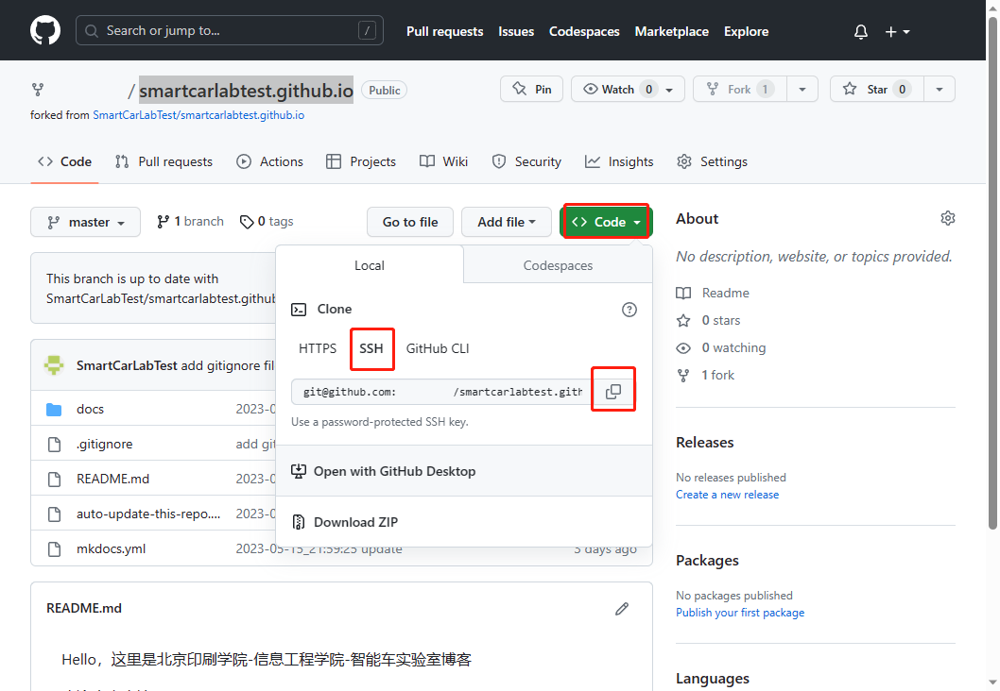
  >
  > - 新建一个与远程仓库同名的文件夹，并进入
  >
  >   ```bash
  >   mkdir smartcarlabtest.github.io
  >   cd smartcarlabtest.github.io
  >   ```
  >
  > - 进行仓库的初始化工作
  >
  >   ```bash
  >   git init
  >   git config user.name "你的GitHub用户名"
  >   git config user.email "你的GitHub的注册邮箱"
  >   git remote add blog <刚才复制的你的仓库地址>	# 注意，这里粘贴的时候可以用鼠标右键 `Paste` 来粘贴，如果已安装好搜狗输入法，也可以用 Ctrl + ; 组合键来选择粘贴。
  >   ```
  >
  > - 之后我们就可以从远程仓库拉取内容了，执行以下语句：
  >
  >   ```bash
  >   git pull blog HEAD
  >   ```
  >
  >   即可拉取完毕，且自动生成 `master` 分支。
  >
  >   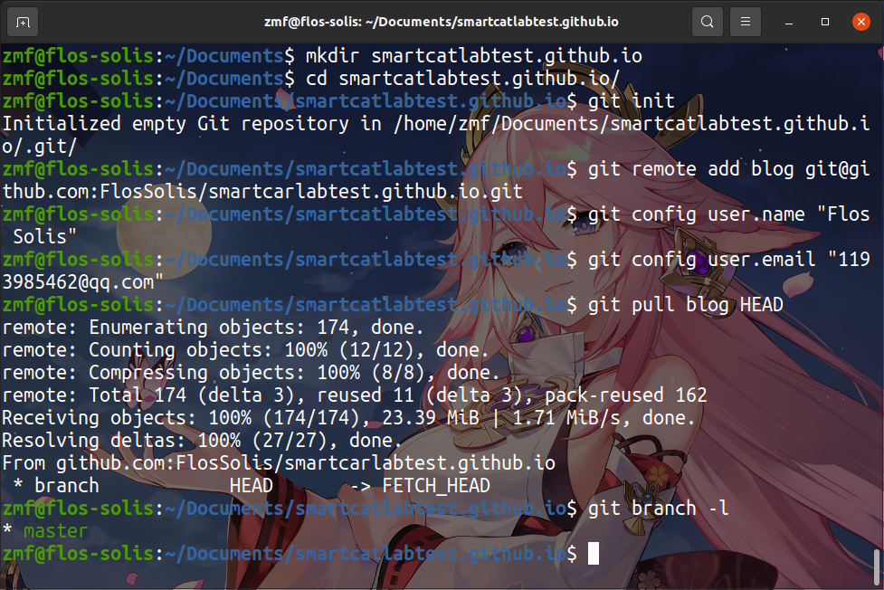

- 此时我们即部署完毕。

## 3. 修改内容

我们可以用 `Vim` 编辑器 或者 `Visual Studio Code` 编辑器来编辑博客内容。

### Vim 编辑器

> 这里建议您先通过 `Vimtutor` 来进行 `Vim` 编辑器 的学习，但我仍给出一些基本操作。

- 我们打开 `Terminator` 或 终端，进入本地仓库文件夹，输入 `Vim .` 来遍历目录。

  > 基本操作：
  >
  > - 上 `k` 下 `j` 左 `h` 右 `l` ，同时键盘的上下左右键也可以用。
  >
  > - `Enter` 键打开目录或文件，`..` 目录即为上一级目录， `.` 目录即为本级目录。

- 选择好你想要编辑的文件，进行编辑操作。

  > - 默认为命令模式，`i` 键进入编辑模式，并在光标所在字符前开始编辑， `Esc` 键退出编辑模式，回到命令模式。
  > - `a` 键进入编辑模式，并在光标所在字符后开始编辑
  > - 命令模式下， 输入 `:wq` 并回车即可保存退出 （`w` 键为 "write" 的意思，`q` 键为 "quit" 退出的意思）

### VS Code 编辑器

> 作者建议您先在互联网上找到一些资源来进行 `VS Code` 编辑器的学习。

## 4. 上传到远程仓库

- 保存好文件后，通过终端执行以下命令：

  ```bash
  git add .
  git commit -m "本次提交的内容，著作人等信息"
  git push blog master
  ```

  效果如下图：

  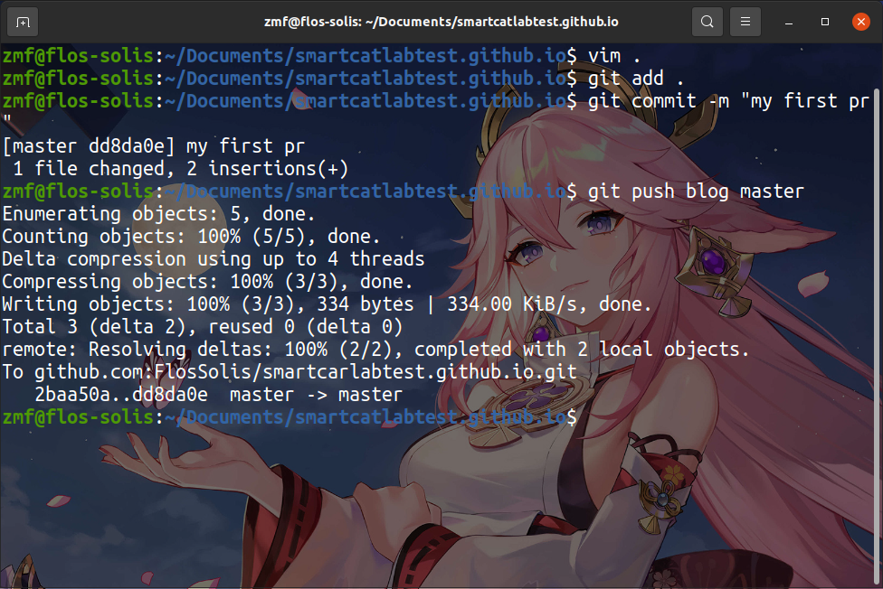

  > 注意：第一次提交时，Git 会询问是否用SSH来连接（大概意思），输入yes，回车即可。

## 5. 在GitHub网页提交已修改的内容，待审核。

好的，我们回到我们的远程仓库。

- 点击 `Contribute` 下的 `Open pull request` ，进入提交页面：

  

- 下面有三个要点：

  - 首先，选择要提交到的分支：
  
    注意，必须提交到 `dev` 分支，不能提交到其他分支，否则无法合并与接收。
    
  - 其次，要在 `Leave Comment` 区域内，进行说明：
  
    > 说明的内容有：
    >
    > - 时间：1999-xx-xx xx:xx
    > - 提交者：YOUR_NAME
    > - 更改内容：
    >   - 可以分更多的点，每个文件的更改内容都要简略写出，审核者会在之后进行查看具体的更改内容。
  
  - 最后，在都填写并检查无错误的情况下，点击 `Create pull request` ，等候博客管理者审查合并你的提交即可。
  
    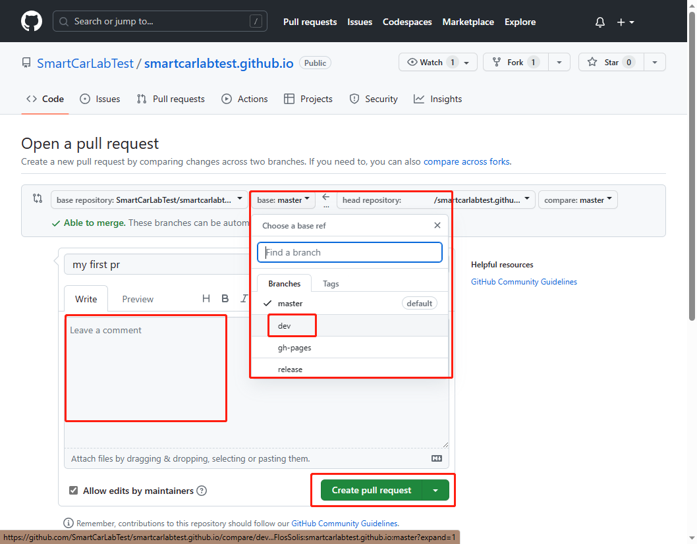

