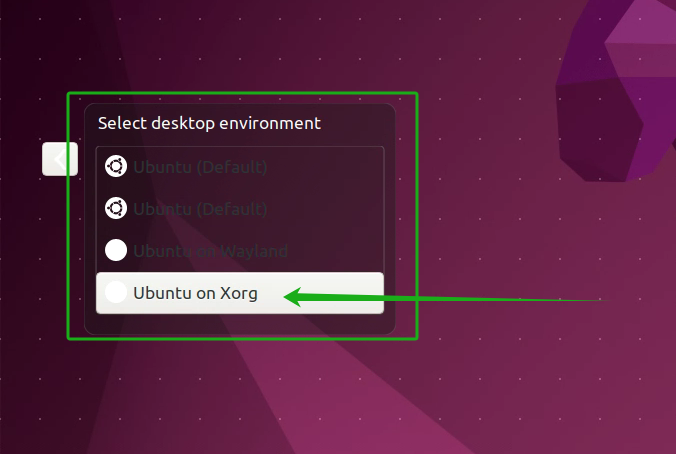

# Ubuntu 22.04 远程桌面

> author: Haohahahaha (Haorui Zhang)
>
> mail: 1259203802@qq.com
>
> date: 2024-07-12

!!! note ""
    
    昨天江总找咱配电脑，说起要用到Linux，于是我心生一计，给江总搞个虚拟机，加上远程桌面，不就非常容易解决学习环境问题了嘛。说干就干。

## 主要思路

使用向日葵提供的解决方案，比较靠谱。

首先在知乎上找到了一个远程桌面的解决方案[^1]，按照其操作后发现卡在向日葵进入远程连接的界面了，于是也找到了解决方案[^2]。

[^1]: [Windows远程桌面Ubuntu22.04（xrdp或向日葵）-Ubuntu系列02 - Fail才是常事的文章 - 知乎](https://zhuanlan.zhihu.com/p/659994999)

[^2]: [Ubuntu重启后向日葵远程连接一直卡在连接界面 - CSDN](https://blog.csdn.net/fighting_88412/article/details/133857593)

## 主要步骤

1. 下载Linux的[向日葵图形版](https://sunlogin.oray.com/download/linux?type=personal)安装包
   
   

2. 安装 `deb` 包

    

3. 安装 `lightdm`，安装完成后弹出一个窗口，选择 `lightdm` 即可

   > 若误操作，可运行命令 `dpkg-reconfigure lightdm` 重新设置

   

4. 运行向日葵（可登录自己账号，也可使用识别码+永久验证码）

    

5. 注销用户，用远程端登录的时候，选择 `Ubuntu on Xorg`，即可完成。

    

