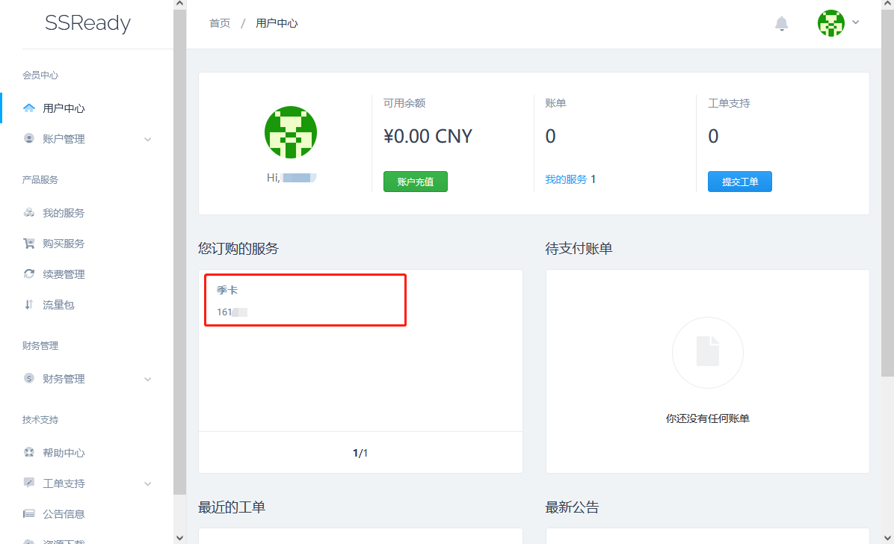
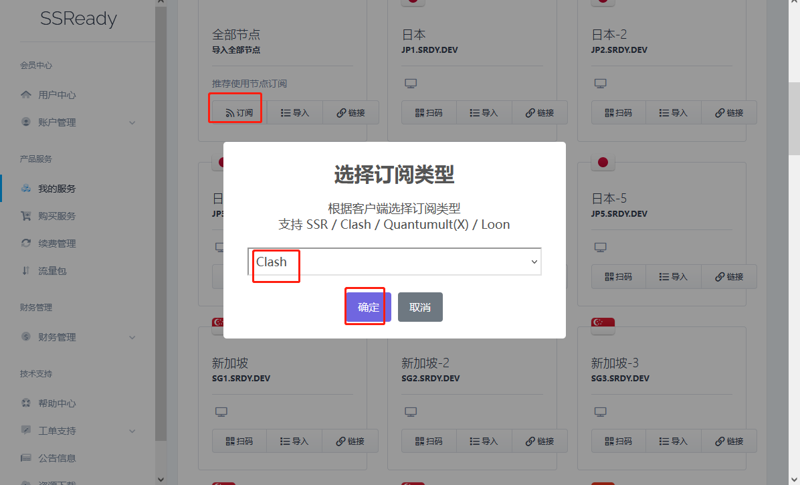

# Ubuntu2204 工作台搭建全流程

> 撰稿日期：2023-05-07
>
> 截稿日期：2023-05-14
>
> 作者：张浩睿

**必备条件：完成 `VMware Workstation 15+` 的安装** 

> 我的版本是16，都可以，在网上搜索资源即可。

## 1. 新建虚拟机

- 打开 `VMware Workstation`， 点击 `文件选项` ，点击 `新建虚拟机` （快捷键：`Ctrl + N` ）


- 点击 `自定义（高级）`

> 其实 `典型` 选项也可以，不过不够炫酷&#x1F60B;，也不够细致。 


- 默认选择 `Workstation 16.x` ，下一步即可


- 选择 `稍后安装操作系统` ，下一步


- `客户机操作系统` 选项，选择 `Linux`


- `版本` 选项，选择 `Ubuntu 64位`


- `虚拟机名称` ：填写一个你记得住的名字，一般来说，`系统版本` + `工作用途` 这样的名称会使你更容易在很多的虚拟机中找到你想使用的那一台。

- `位置` ：选择一个你喜欢的地方，可以点击右侧 `浏览` 按钮来浏览文件夹，以便选择你想要安装的地方，比如 `D:\Your_Virtual_Machine`。

  > &#x1F31E;推荐：虚拟机保存在更快的存储设备上，速度由快到慢，大致分为：`固态硬盘(M.2)` > `固态硬盘(SATA)` > `机械硬盘(HDD)` 。各硬盘的具体读写速度以实际情况为准，需读者自行调查。


 - 设置处理器内核数量

   $处理器内核总数 = 处理器数量 \times 每个处理器的内核数量$

   > &#x1F31E;推荐：一般情况下，只需要遵循 `处理器内核总数` < `宿主机线程总数` 这个原则即可。

   - 在个人PC上（单CPU情况下）

     - 一般来说只有一颗CPU（看得见摸得着的物理CPU），所以在 `处理机数量` 一栏，填写为 `1` 即可；

     - 想设置更多的 `处理器内核总数` ，只需要调整 `每个处理器的内核数量` 即可，且数量一定小于等于`宿主机线程总数`。

       > 线程数怎么数呢？打开 `任务管理器` 的 `性能` 一栏，右键利用率视图部分，选择 `将图形更改为` ->`逻辑处理器`，出现的“框框”总数，就是 `宿主机线程总数`。（我们一般把这个行为叫做 `数框框` &#x1F60B;）
   
       > &#x2B50; 注意：一般来讲，对于一般的电脑，我们建议 虚拟机的 `处理器内核总数` 设置为`宿主机线程总数` 的一半；如果电脑配置比较好，线程较多，可以按将虚拟机的 `处理器内核总数` 设置为 `宿主机线程总数`  的 $\frac{2}{3}$ 左右，这样可以让虚拟机有更好的性能。\
     
   - 多CPU情况下：
   
     - 如果物理上有多颗CPU，则建议把虚拟机的 `处理器数量` 设置为和物理机一致，而 `处理器内核总数` 同上进行设置，将虚拟机的 `处理器内核总数` 设置为 `宿主机线程总数` 的一半，如果电脑配置比较好，线程较多，可以按将虚拟机的 `处理器内核总数` 设置为 `宿主机线程总数` 的 $\frac{2}{3}$ 左右。
   
   > &#x2B50; 注意：windows 非 server 版的系统是不支持超过两个处理器的，win10的版本限制为 **家庭版、专业版** 和 **教育版** 最大支持 双路CPU，**工作站版**和**企业版** 是 四路CPU。


- 设置内存量

> &#x1F31E;推荐：一般来说，`Ubuntu22.04` 的内存量在 `4~8GB` 即可很流畅地使用了；内存大小不建议超过 `宿主机内存容量` 大小的一半。


- 设置网络类型

> &#x1F31E;推荐：使用默认配置即可。

> 关于 `Ubuntu` 内使用 `科学上网`，建议使用 `Clash`，细节另表；付费的科学上网，提供一个[链接](https://ssready.io)。


- 设置 `I/O` 控制器类型

> &#x1F31E;推荐：使用默认配置即可


- 设置磁盘类型

> &#x1F31E;推荐：使用默认配置即可。


- 选择磁盘

> &#x1F31E;推荐：使用默认配置即可。


- 指定磁盘容量

> &#x1F31E;推荐：
>
> - `最大磁盘大小` 使用默认配置即可；
> - 选择 `将虚拟磁盘存储为单个文件`。


- 指定磁盘文件

> &#x1F31E;推荐：使用默认配置即可。


- 完成虚拟机设置

点击 `完成` 即可。


- 完成效果：


## 2. 安装Ubuntu 22.04 LTS 系统

- 首先下载系统镜像，复制下方链接到浏览器地址栏，回车访问，即可开始下载。

> 镜像链接：https://mirrors.tuna.tsinghua.edu.cn/ubuntu-releases/22.04/ubuntu-22.04.2-desktop-amd64.iso


- 点击设置 虚拟机的 `CD/DVD` 


- 选择ISO映像文件

   - 首先选择 `启动时连接`

   - 然后点击 `浏览` ，选择下载好了的镜像文件

     > 一般来说，浏览器下载好的文件会在 `此电脑 > 下载` 目录里，如果已修改文件的下载目录，则去对应目录寻找即可。

   - 最后，点击 `打开` ，然后点击`虚拟机设置`窗口的 `确定` 按钮。


- 开启虚拟机，读盘，准备安装

> &#x1F31E;推荐：等待几秒钟就进入安装界面了。


- 进入安装界面

   - 默认选择语言为 `English` 

     > &#x1F31E;推荐：使用英语，因为通常情况下，`Ubuntu(即Linux)` 的系统信息以英文表示，读英文有利于理解系统原生信息。
     >
     > &#x2757;这很重要。

   - 点击 `Install Ubuntu` 进入安装流程


- 键盘设置

> &#x1F31E;推荐：使用默认配置即可。


- 配置安装选项

   - 选择 `Minimal installation` ，即最小化安装。

   - > &#x1F31E;推荐：下方蓝色框内**都要取消选中**
     >
     > 否则安装时间会很长，甚至无法安装（因为会连接国外网络，我们假定此时还不能连接外网）


- 默认选择擦除磁盘即可
   - 点击 `Install Now`
   - 点击 `Continue`


- 选择时区/地点

   > &#x1F31E;推荐：选择中国区域内，默认即可。


- 设置用户名、密码和主机名称

    - 起两个你喜欢的名字吧！

    - 注意，密码不要忘记咯！

      > &#x1F31E;推荐：因为密码在后面安装程序的时候要用到很多次，如果是单纯自己学习用，不是很重要的话，建议设置一个很简单的密码，方便。

    - 红色框内，第一行是 `开机自动登录` ，第二行是 `开机登录需要密码`，按个人喜好决定。

      > &#x1F31E;推荐：省点儿事，还是自动登录好。


- 点击安装后，开始安装系统。
    - 左侧小箭头点开可以看到安装细节；
    - 右侧 `Skip` 按钮只要能点击了，就立即点击，节省时间。


- 安装完成，点击重启即可。

> &#x1F31E;推荐：直接关机，以便下一步我们退出 `CD/DVD`，以及后续安装 `VMware Tools`


- 退出 `CD/DVD`

    - 点击设置`CD/DVD`

      

    - 点击 `使用物理驱动器` 即可。

      

- 再次启动，即可进入系统，进行初始化设置

    - 点击 `Skip` 以跳过

      

    - 点击 `Next` ，下一步

      

    - 点击 `No, ...` ，就没必要向官方发送错误信息了；下一步。

      

    - 点击 `Next` ，下一步

      

    - 点击 `Done` ，完成初始化

      

    - 我们的系统就安装好了，如下：

      

## 3. 安装相关软件

### 1. 更改国内软件源

- 点击左下角应用菜单，然后选中红色框内的应用，点击打开


- 打开后选择下载服务器，点击红框处，选择`Other`


- 向上找到 `China` 后，展开列表，选择一个你喜欢的源。
   - 然后点击 `Choose Server` ，输入用户密码即可

> &#x1F31E;推荐：选择 `mirrors.ustc.edu.cn` ，中科大的下载服务器（清华、阿里源都不错）


- 拖动窗口，点击 `Close` 即可


### 2. 更新软件源和软件

桌面打开终端，输入命令：

```bash
sudo apt update # 更新软件源，后面默认回车即可
sudo apt upgrade # 更新软件，后面默认回车即可
```


### 3. 安装 `VMware Tools`

`VMware Tools` 可以帮助我们随意调节虚拟机显示器大小，也可以帮助虚拟机与宿主机之间进行文件传递，很实用，必备！

- 点击 `虚拟机` 菜单，选择 `(重新)安装 VMware Tools`


- 点击后，虚拟机会载入一张光碟，如下图，我们点击打开它。


- 右键压缩包，复制到桌面上。


- 在桌面右键空白处，点击 `Open in  Terminal` 打开终端

   - 解压命令： `tar zxvf VMwareTools-*-.tar.gz`

     > &#x1F31E;推荐：输入时，输入 `tar zxvf VM` ，然后按下键盘左侧的 `Tab` 键，终端会自动补全文件名，回车即可


- 输入 `cd vmware-tools-distrib`，进入解压好的文件夹。


- 此时会打开终端（命令行）
   - 输入 `sudo ./vmware-install.pl` ，回车
   > &#x1F31E;推荐：输入时，输入 `sudo ./vm` ，然后按下键盘左侧的 `Tab` 键，终端会自动补全文件名。
   - 输入刚才设置好的密码，回车
   - 会弹出一些信息，大意是“是否要进行安装”，直接输入 `yes` ，然后一路回，默认安装（注意期间如果遇到询问的且后面跟 `[no]` 的先不要回车，先输入y然后在回车）


- 重启系统后，输入命令 `sudo apt install open-vm-tools-desktop -y`


- 再次重启，即可安装成功。删除桌面的两个文件即可。


### 4. 安装&配置一些用来开发的软件

#### 1. Vim

终端里输入：

```bash 
sudo apt install vim -y
```

即可安装完成。（有可能需要输入用户密码，不一定）

#### 2. Terminator

终端里输入：

```bash 
sudo apt install terminator -y
```

即可安装完成。（有可能需要输入用户密码，不一定）

#### 3. Visual Studio Code (VSCode)

##### VSCode安装

网址：https://code.visualstudio.com/

点击红色框，下载deb安装包


打开下载文件夹，右键进入终端，输入后回车：

```bash
sudo dpkg -i code_*.deb #(*为省略)
```


打开应用列表发现图标已经出现，安装完成。


##### <a id="vsc-markdown">VSCode Markdown 插件安装</a>

> 已安装Typora的读者无需阅读此模块。
>
> 可阅读链接：[搭建 Markdown 强大写作环境（VSCode） - 端水大法师的文章 - 知乎](https://zhuanlan.zhihu.com/p/139140492)

在VSCode里面安装两个插件，分别是：

- Markdown Preview Enhanced
- Markdown All in One

安装方法：

打开VSCode，点击左侧边栏的 `扩展` 按钮，输入 `markdown` 进行搜索，这两个插件经常会出现在搜索结果的上面，点击 `Install` 即安装完毕。之后创建新md文件即可运用。


#### 4. Typora

> &#x1F37A;**Typora是一款非常好的Markdown编辑器，其功能强大，界面简洁，便于编写文档、博客，其展示内容丰富，语法简单，结构清晰，是程序员必备写文档/博客良品！**&#x1F60B; 

> 关于Markdown语法，这里给出一个链接以供学习，读者也可自行搜索网络资源来学习。
>
> https://markdown-it.github.io/（可能速度慢一点）

官网下载deb包，链接：https://typoraio.cn/#linux

点击红框，下载文件


然后在下载文件夹，右键空白处，打开终端执行命令：

```bash
sudo dpkg -i typora_*_*.deb # *为省略号
```


打开应用列表发现图标已经出现，安装完成。


#### 5. Firefox

系统自带，不需安装。

#### 6. Sougou Input Method (搜狗输入法)

官网下载链接：https://shurufa.sogou.com/?r=mac&t=pinyin

浏览器打开链接后，选择 `Linux x86_64` 版本的 `deb` 安装包，下载。


然后从下载文件夹打开终端，输入以下命令：

```bash
# 安装fcitx
sudo apt install fcitx-bin
sudo apt-get install fcitx-table 

#安装依赖
sudo apt install libqt5qml5 libqt5quick5 libqt5quickwidgets5 qml-module-qtquick2
sudo apt install libgsettings-qt1

#安装软件
sudo dpkg -i sougoupinyin_*.deb # *为省略
```

- 打开系统设置


点击 `Region & Language (区域与语言)` ，然后点击 `Manage Installed Languages (管理已安装语言)`


- 第一次点开的时候 系统会弹窗，点击 `Install` 稍微等待一下即可。


- 安装完成后，点击 `IBus` ，切换为 `Fcitx 4` ，然后点击 `Apply Sytem-Wide (应用到整个系统)`，操作完成后重启。


- 重启完成后，添加搜狗输入法

点击右上角的小键盘图标，选择“配置当前输入法”


- 取消勾选左侧框，拉到最下面，即看到 `sogoupinyin` ，选中，点击 `OK` 即可。


- 将搜狗拼音置顶，点击下方 向上的箭头 即完成安装，关闭重启即可。


- 安装完毕，效果如图


### 4. 科学上网

> 安装Clash 以及 科学上网全流程（含Clash安装教程）

#### 1. 购买科学上网服务

> 我常用的链接：https://ssready.io

进入网站进行购买即可，购买完毕后，进入用户中心

点击 `您订购的服务` 栏内的已购服务



- 找到全部节点，点击 `订阅` ，然后选择`Clash`，点击 `确定` ，然后点击 `复制链接` 。（后面有用，如果剪贴板还有其他用处，请把这个链接暂存到一个位置）



#### 2. 安装Clash

> 下载地址：https://github.com/Fndroid/clash_for_windows_pkg/releases

x86处理器下载 `Clash.for.Windows-*-x64-linux.tar.gz`

打开下载文件夹，进入终端，执行命令：

```bash 
sudo tar zxvf Clash.for.Windows-*-x64-linux.tar.gz	# *代表版本号，可能不同，版本均可
cd Clash\ for\ Windows-*-x64-linux		# 进入解压好的文件夹
./cfw	# 即可运行
```

打开后的界面如下：


然后我们设置：

- `Start With Linux` ：开机自启动
- `Allow LAN` ：允许局域网（本机）连接
- 配置机场：这里选择订阅Url的形式（输入url,点击Download），直接配置文件也可以(Import)


打开 `Proxies` 一栏，点击 `节点选择` 即可选择连接哪个节点了。

> `Check` 为检测网速，在直连情况下检测到各个节点的网速最准确。


我们从 `General` 中得知端口号，进入系统设置-网络，配置代理。


重启一下，即可正常连接。


## 4. 美化与配置

### 1. 桌面美化

- 更换桌面背景

  `Settings-Background` 下，可设置。

  > 可以导入自己的照片，然后点击 `Add Picture` 即可设置为桌面背景；
  >
  > 也可以选择系统的一些照片。

- 更换系统颜色

  `Settings-Appearance` 下，可设置。

  > 推荐设置：
  >
  > - `Style` : `Dark`（系统主题）
  > - `Color` : 看心情（颜色）
  > - `Desktop Icons` : （桌面图标）
  >   - `Size` : `Small` （大小）
  >   - `Show Personal folder` :  `Off` （桌面是否显示用户文件夹）
  > - `Dock` : 
  >   - `Auto-hide the Dock` : `On` （自动隐藏任务栏）
  >   - `Panel mode` : `Off` （经典模式为on，悬浮模式为off）
  >   - `Icon size` : 看心情（图标大小）
  >   - `Position on screen` : `Bottom` ，其实还是看心情（任务栏位置）

- 增加/删除 `Favorites（任务栏固定的应用）`

  - 增加：打开应用菜单，右键你想要添加的应用图标，选择 `Add to Favorites` 即可固定
  - 删除：右键 `Dock` 栏上的图标，选择 `Remove from Favorites` 即可取消固定

- 进阶：`Gnome-tweaks`

  > 这里只给出一些可参考的链接，读者可自行在 `知乎` / `Bilibili` 等网站搜索“Gnome 桌面美化”
  >
  > Ubuntu23.04桌面美化 - 爱读书的狮子的文章 - 知乎 https://zhuanlan.zhihu.com/p/624489118
  >
  > Ubuntu20.04 桌面美化(详细+简单) - QNCY的文章 - 知乎 https://zhuanlan.zhihu.com/p/340468652

### 2. 系统设置

- 关闭自动锁屏

  `Settings-Power-Power Saving Options`

  `Screen Blank` : `Never`

  

- 设置切换桌面的快捷键

  `Settings-KeyBoard-Keyboard ShortCuts`

  - `Navigation` :
    - `Move to workspace on the left` : `Ctrl + Super + k` （点击选项后，直接敲击键盘组合键即可）
    - `Move to workspace on the right` : `Ctrl + Super + j`（方法同上）

  

### 3. 终端美化

#### 1. Terminator美化

> 以下为推荐配置，一键配置请点击：<a href="#config-terminator">默认布局</a>

打开 `Terminator` ，右键，选择 `Preferences (个性化/设置/优先的意思)` ，进入，开始配置


- `Global` :

  - `Unfocused terminal font brightness` : `100%` （未使用的终端窗口的亮度，推荐100%）
  - `Title bar at bottom` : `off`
  - `Use System font` : `off`
    - `Font` : `Ubuntu Mono Regular` `18`

  

- `Profiles`

  - `General`

    - `Use the system fixed width font` : `off`
    - `Font` : `Ubuntu Mono Regular` `18`

    

  - `Colors`

    - `Built-in schemes`
      - `Text Color` : `White`
      - `Backgound Color` : `Black (Default)`

    

  - `BackGround`

    > 作者一般喜欢设置一个漂亮的桌面背景，然后在此应用全屏模式下，可以看到，故采用设置透明度的方式。

    选中 `Transparent backgound`	

    `Shade background` : `0.60 (推荐值)`

    另，`Background Image File` 也可以单独设置此应用的背景。

    

  - `Scrolling`

    `Scrollbar is` : `Disabled`

    > 这样看起来更简洁，没有侧边滑动栏。

    

- <a id="config-terminator">默认布局</a>

  > 这个网上游很多教程，我仅给出我的配置文档，还有详细的快捷键等功能，读者可按需自行设置。
  >
  > `Terminator` 和 `Vim/VSCode/gedit(文本工具)` 的具体使用方法请读者自行搜索。
  >
  > 此配置文件路径： `~/.config/terminator/config`
  >
  > 实际上，直接复制粘贴进去之后，即可获得与我一样的配置效果，无须配置上面的环境。
  
  ```config
  [global_config]
    borderless = True
    title_inactive_bg_color = "#ffffff"
    inactive_color_offset = 1.0
    suppress_multiple_term_dialog = True
    title_use_system_font = False
    title_font = Ubuntu Mono 20
  [keybindings]
  [profiles]
    [[default]]
      icon_bell = False
      background_darkness = 0.6
      background_type = transparent
      cursor_color = "#aaaaaa"
      font = Ubuntu Mono 16
      foreground_color = "#ffffff"
      show_titlebar = False
      scrollbar_position = hidden
      palette = "#888a85:#ef2929:#4df3b0:#fce94f:#729fcf:#ad7fa8:#8ae234:#eeeeec:#555753:#ef2929:#61e0ad:#edd400:#204a87:#5c3566:#73d216:#babdb6"
      use_system_font = False
  [layouts]
    [[default]]
      [[[child0]]]
        type = Window
        parent = ""
        order = 0
        position = 0:0
        maximised = False
        fullscreen = True
        size = 1440, 900
        title = hanzhe@blackhawk: ~
        last_active_term = b39f0c4d-3420-4080-a277-38ec1a5f9cbe
        last_active_window = True
      [[[child1]]]
        type = HPaned
        parent = child0
        order = 0
        position = 718
        ratio = 0.5003484320557491
      [[[child2]]]
        type = VPaned
        parent = child1
        order = 0
        position = 448
        ratio = 0.5005586592178771
      [[[terminal3]]]
        type = Terminal
        parent = child2
        order = 0
        profile = default
        uuid = 6c44ec24-c30e-486f-9954-3cc69f7cbc1e
      [[[terminal4]]]
        type = Terminal
        parent = child2
        order = 1
        profile = default
        uuid = b39f0c4d-3420-4080-a277-38ec1a5f9cbe
      [[[terminal5]]]
        type = Terminal
        parent = child1
        order = 1
        profile = default
        uuid = 08898081-f620-4f26-96e0-7bd421832e65
  [plugins]
  ```
  

效果如图：


#### 2. 终端美化

打开终端，右键空白处，点击 `Preferences` ，即可打开配置。

- `Text`

  - `Custom font` : `Ubuntu Mono` `18`

  

- `Colors`

  - `Use colors from system theme` : `off`
  - `Default Color`
    - `Text` : `#FFFFFF (White)` 
    - `Background` : `#000000 (Black)`
  - `Use transparent background (透明度)` : `60% 左右`
  - `Palette`
    -  `Color palette` : `Custom` （颜色读者自行配置）

  

- `Scrolling`

  - `Show Scrollbar` : `off`

  

### 4. Vim配置               

> 更多的配置请读者自行搜索，知乎上面有很多详细教程。
>
> 配置文件在：`~/.vimrc`           

```config
set nu		# 设置行号
set ts=4	# 设置Tab键为4个空格
syntax on	# 高亮打开
filetype on # 基于不同文件后缀定义高亮
```

大概效果如下：


### 5. Typora美化配置

> 记得购买正版哦
>
> 如果不想购买正版，也可点击 <a href="#vsc-markdown">VSCode Markdown 插件安装</a> 部分，在VSCode里面编辑Markdown文档。

打开Typora，点击 `File - Preferences` ，进入设置


点击 `Appearance` ，可以看到 `Themes` 一栏，可选择不同主题。

还有`Get Themes` 按钮，可以联网下载，安装更多读者喜欢的主题。


本文以 `GitHub Dark` 主题为例：

- 点击 `Get Themes` ，进入网站，点击 `GitHub Dark Themes`

  

- 点击 `Download` 即可下载

  

- 下载完成后，进入下载文件夹，右键文件，点击 `Extract Here` 直接解压

  

- 进入解压好的文件夹，复制如下文件：

  > 其他主题可能还要复制更多文件，具体详见每个压缩包解压后的 `README.md` 文档。

  - `github-dark-defult.css`
  - `github-dark-dimmed.css`
  - `github-dark-high-contract.css`

- 回到Typora，点击 `Open Theme Folder`，将刚才复制的三个文件拷贝进去，重启即安装完成。

安装好效果如图：


### 6. VSCode美化配置

> 关于VSCode的美化，作者只进行了主题的更改。其余的美化配置，读者可自行按需搜索。
>
> 可参考链接：
>
> - [史上最全vscode配置使用教程 - 灰蓝宇墨的文章 - 知乎](https://zhuanlan.zhihu.com/p/113222681)
>
> - [vscode必备插件，美化、炫酷、实用-留着防丢 - 珑long的文章 - 知乎](https://zhuanlan.zhihu.com/p/112016680)

主题更改：

输入快捷键 `Ctrl + K` `Ctrl + T` （操作就是长按 `Ctrl` 键然后依次按 `K` `T` ）

上下选择即可。 


---

---

---

## 结语

至此， `Ubuntu 22.04` 的工作台就搭建完毕了。

希望本文能够帮助读者一些。

下面，就请开始你的开发之旅吧！

截稿于2023年05月14日13:51
