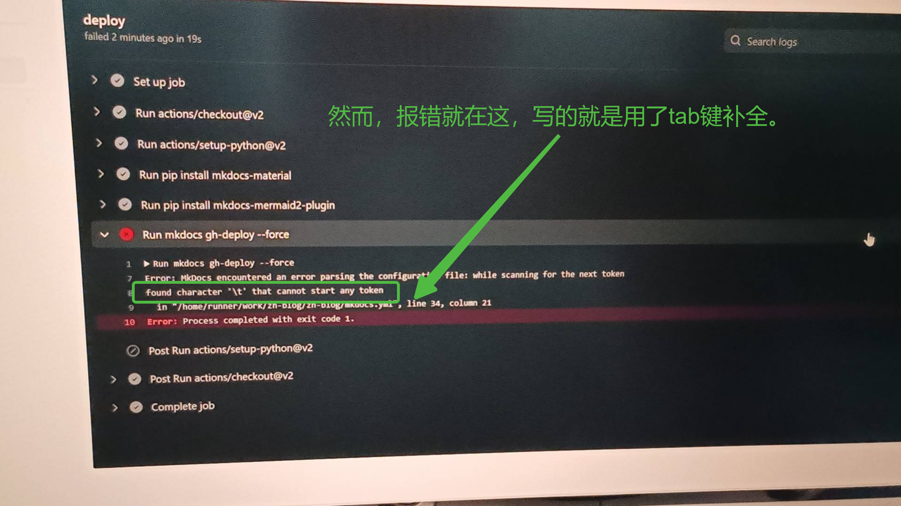
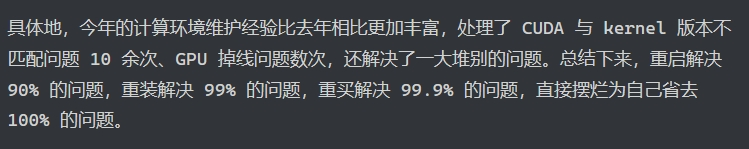

# 提问的小练习

> author: Haohahahaha (Haorui Zhang)
>
> email: 1259203802@qq.com
>
> date: 2023-11-20

### 前言

本文将举一些提问的实战例子，以便读者理解——如何提问。

> P.S.: 多亏了赵总，才有辣么多素材……

## 例1: 红烧肉盖饭

??? lezi "先放出来聊天记录看个乐"

    

    于是就有了红烧肉盖饭的晚餐（笑）——真香嘿。

!!! info "遇到的问题"

    场景：无序列表与有序列表在 mkdocs 下的语法
    
    1. 

	2. 

	3. 

!!! question "请按照 提问的智慧 其中的规则进行尝试解决与提问。"

??? success "参考的做法"
    
	- 尝试解决

	- 提问

## 例2: 拒绝有意失明人士

??? lezi "还是一个乐子，但有点气人"
    
    

    

    

!!! info "遇到的问题"

     - 编辑了 `mkdocs.yml` 后上传到 Github， Githuv Action 报错，信息如下：

	 - 

!!! question "请按照 提问的智慧 其中的规则进行尝试解决与提问。"

??? success "参考的做法"

    1. 仔细观察报错信息，发现报错信息主要集中在 `Error: `之后；

	2. 提取关键信息，例如 `found character \'\\t\'` `in [FILE_NAME], line [LINE_NUM], column [COLUMN_NUM]`，如果看不懂英文，请打开 [Google Translate](http://translate.google.com)，它会帮助你；

	3. 如果还看不懂错误信息的意思，请搜索。

	> "没用Tab。"

## 例3: 向提问の智慧完全体进发！

???+ lezi "屡试不爽的金句"

    

	> 本图片来源：[Aiden Li 的 2022 年度报告](https://blog.aidenli.net/2022/12/24/annual-summary/2022-summary/)

!!! info "遇到的问题"

    Clash 在 Ubuntu 22.04 环境下无法启动，卡死并导致死机

!!! question "请按照 提问的智慧 其中的规则进行尝试解决与提问。"

??? success "参考的做法"

    1. 如折叠的乐子所述，重启解决99%问题——赵总显然解决了；

	2. 我赠送了一个 墨墨背单词图标 的表情包，以示回敬：“太闲了就去背单词”；

	    1. 重启都懒得重启，还打电话问我

		2. 验证都不想验证，想借着我的经验获取 `二手知识`

		3. 总结：太懒了

    3. 如下是正解：

	    1. 把能想到的办法都想一想，并且去尝试，记录尝试过程的电脑反应等

		2. 实在想不起来的时候，想去问朋友之前，再尝试想想办法——“就没有别的办法了吗” 

		3. 真的真的想不起来了，好吧，真的要向他人问一问问题，那么请做到:

		    1. 能够列出你尝试过的所有办法
			2. 每个尝试过的办法有详细记录，且说明出错点
			3. 出问题之前的的关键性动作（尽管可能是不经意间的）都要列出来

