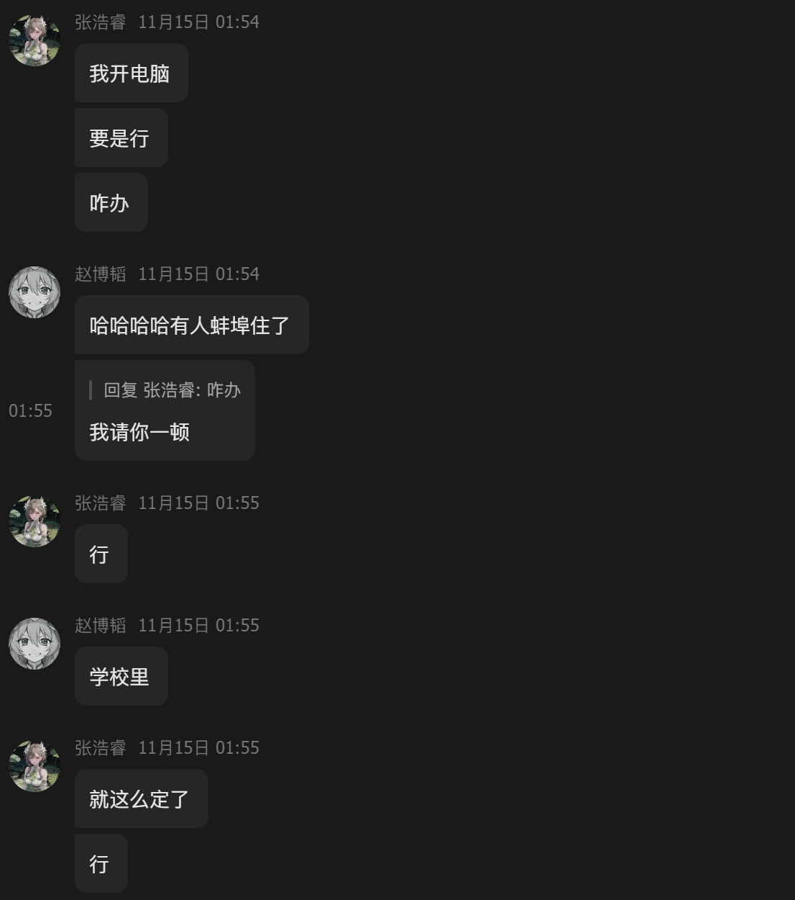
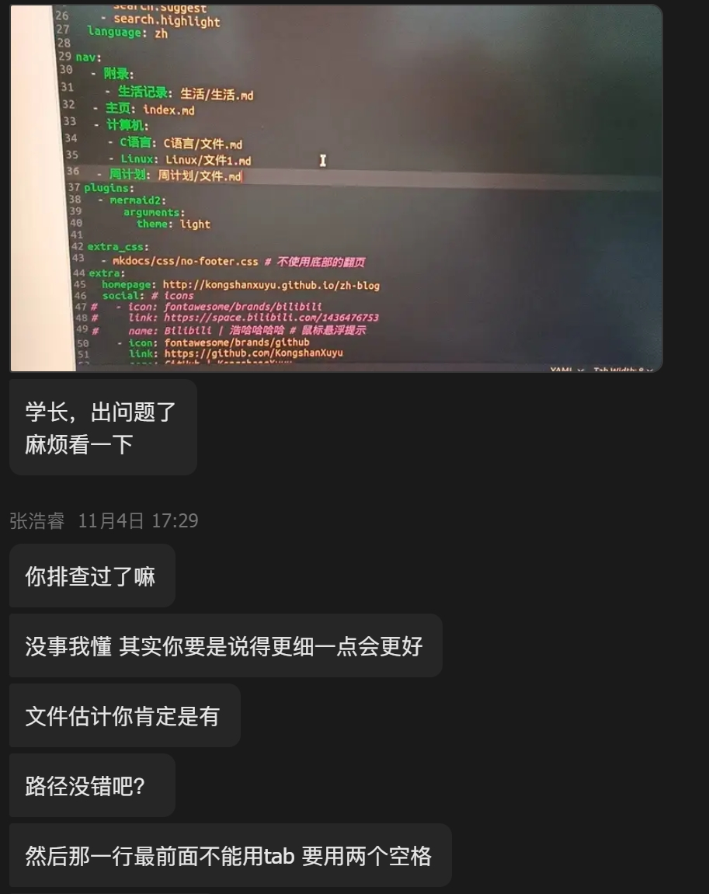
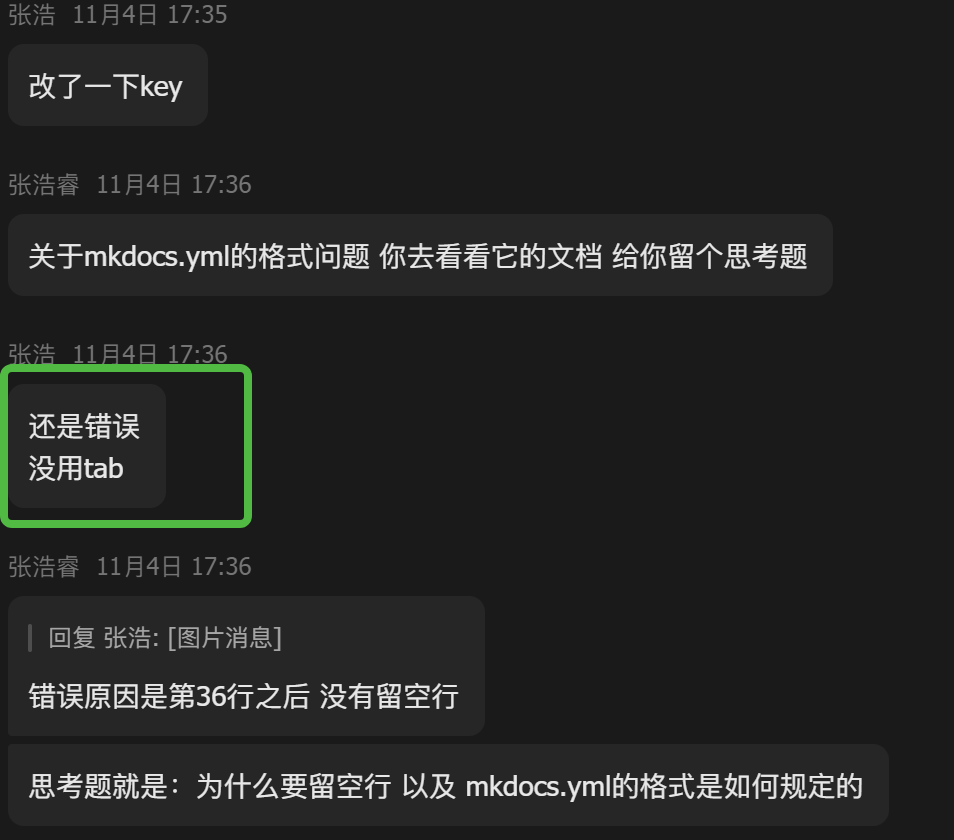

# 提问的小练习

> author: Haohahahaha (Haorui Zhang)
>
> email: 1259203802@qq.com
>
> date: 2023-11-20

### 前言

本文将举一些提问的实战例子，以便读者理解——如何提问。

> P.S.: 多亏了赵总，才有辣么多素材……

## 例1: 红烧肉盖饭

??? lezi "先放出来聊天记录看个乐"

    

    于是就有了红烧肉盖饭的晚餐（笑）——真香嘿。

---

### 场景：无序列表与有序列表在 mkdocs 下的语法

???+ info "遇到的问题"
    
    1. 

	2. 

	3. 

??? question "请按照 提问的智慧 其中的规则进行尝试解决与提问。"

??? success "参考的做法"
    
	- 尝试解决

	- 提问

## 例2: 拒绝有意失明人士

??? lezi "还是一个乐子，但有点气人"
    
    

    

