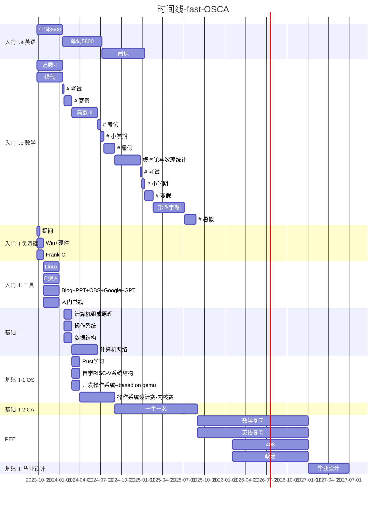
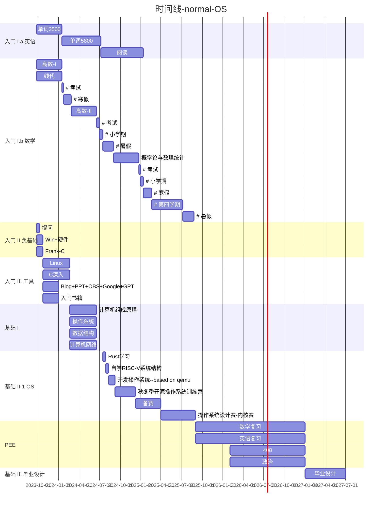
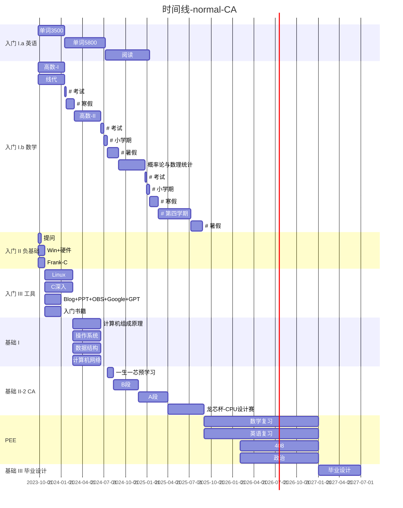

# 个人成长路线-beta

???+ info "更新记录"

	20240305更新：分拆方案为通用升学方案与专业兴趣进阶方案。

	20231219更新：新增清华大学2023秋冬季开源操作系统训练营相关信息，将基础部分改为平行双分支: `OS` 和 `CA`

	20231218更新：依据实践情况，增添工具类的内容，这有助于大幅提高效率。

	20231103更新：入门III、IV阶段进行合并与重写。勾出重点便于使用。

	20230831更新：替换付费课的必修属性，将其替换为开放的课程。

	20230701更新：将数学和英语糅进总体的学习规划中，并加入“一生一芯”计划的学习（同时整合原有计划内路线）。

!!! danger "下面三个时间线是实时的。在白天模式下显示更清楚，但依旧会很小，此处提供<a href="https://github.com/Haohahahaha/cs/blob/master/docs/greenhand/fertile/route-time.md" download="true">下载文件地址</a>，打开后点击右上角下载图标，下载到本地用typora查看更清晰。"

	

时间线-fast-OSCA

时间线-normal-OS

时间线-normal-CA

#### 通用升学方案开始

## 培养方案

!!! question "What I can help"

	1. 通过了解个人的情况，帮助你分析得出 `更为低坡度的学习方案` + `更科学和合理的预期管理`

	2. 根据问题/想法，给出未知的核心搜索关键词（但chatGPT会做的比我更好）；

	3. 帮助更容易地、更高效地学习，而非解答实际问题。

	通过下面的阅读，你会发现，我们定制个人方案主要的方法是OKR。

	我们团队管理也采用了OKR。

### 入门

#### 入门 I.a：英语

- 在遇到大量英文资料之前，至少过完一遍考研大纲5600（时长根据具体情况因人而异，要尽快），之后每日坚持打卡

!!! danger "一学期最低标准"
	
	高中3500词熟悉。

	但是如果这样的话，会阻碍后面学习专业知识的进度。

	届时你会感受到一边看一边查单词，看也看不懂，查也查不明白的美妙体验。

- Better：精读文章(入门期间没精力也正常，但是后面有精力了就要做了)

- Some Useful: 按照主题分类再背单词+读资料，这样可以把同主题的记在一起了。

!!! success "一键解决校内+四级+考研英语+外网资料阅读，一举多得。"

!!! tip ""

	我鼓励你们自己去尝试和探索更适合你自己的学习英语的办法，但要承担浪费时间的必然代价；尽管投石问路——问一问学长学姐会有一定的参考价值，不过毕竟学习办法（有共性，但是）因人而异，不建议完全参考他们的方法。

	我知道的学习方法：学习基础语法，学习读音（读音标准有助于掌握词汇的拼读规律），记忆词汇（对每个语言单元的掌握），背文章（练习分析长单句难句——语句如何停顿，掌握现成的句子，培养语感）。

	仅供参考~

---

#### 入门 I.b：数学（考研复用）

- 杨超高数

- 杨威线代

!!! info "新增补丁"

	如果杨威的风格感觉不能适应，可选择杨超线代（已发至网盘群）。

- 余炳森概率论

!!! success "一键解决校内+考研数学"

!!! tip ""

	实际上要找到适合自己的老师即可，我只是给了一个可供参考的方案。

	如果你想尝试寻找适合自己的老师，我们很鼓励；但我们同时希望你可以花一些时间，认真地去寻找，而非不经过调查和比较，直接替换。

	同样地，我们鼓励你去寻找学习方法。

- 高效书写、管理数学笔记的系列文章：[Gilles Castel](https://castel.dev/)

---

#### 入门 II：负基础——培育计算机人必备素养

!!! info "负基础是什么呢？我认为，比如，上大学是你第一次有机会认真使用电脑。"

1. (没有认真研读的一律判定为负基础) [提问的智慧](https://github.com/ryanhanwu/How-To-Ask-Questions-The-Smart-Way/blob/master/README-zh_CN.md) 和 [别像弱智一样提问](https://github.com/tangx/Stop-Ask-Questions-The-Stupid-Ways/blob/master/README.md)

2. for 负基础的同学：[Windows基础](https://www.bilibili.com/video/BV1vR4y1Q7iF) + [计算机硬件基础](https://www.bilibili.com/video/BV1TL4y1N7ZM)

3. still for 负基础 && 没必要，确实没必要<del>为我院C++课做个衔接适配</del>：

    1. 可以学但没必要，你即将转入Vim的世界。<del>[VS2022](https://www.bilibili.com/video/BV1Xt411g7jT)</del> 

	2. 仅仅用来理解编程语言的入门教程：[C语言 - Frank](https://www.bilibili.com/video/BV1qE411d7Zx)

---

#### 入门 III：工具学习过程

!!! info "工欲善其事必先利其器——漫长又飞速、不可缺少且不可马虎"

##### Linux

!!! info ""
 
	根据[Linux系统安装和基本使用 - ysyx](https://ysyx.oscc.cc/docs/2306/prestudy/0.2.html) 进行拆解，并加入了一些（有一定重复的）内容。

	写学习记录时的简称放在了下面，位置为`[简称]`。

- [Frank Linux]-[Linux操作基础 - Frank](https://www.bilibili.com/video/BV18U4y1W7av)(低坡度付费版，如果喜欢Frank风格，相信你还是可以支持一下的)

- [附录]-ysyx引用NJU-PA(NEMU)的几个附录需要先看一看，这样能解答你很多问题
	
	- [为什么要学习计算机系统基础](https://ysyx.oscc.cc/docs/ics-pa/why.html)

	- [Linux入门教程](https://ysyx.oscc.cc/docs/ics-pa/linux.html)

	- [man快速入门](https://ysyx.oscc.cc/docs/ics-pa/man.html)

	- [git快速入门](https://ysyx.oscc.cc/docs/ics-pa/git.html)
	
- [101]-[Linux零基础用户入门: Linux 101](https://101.ustclug.org/)

- [tmux]-[tmux 使用教程](https://www.ruanyifeng.com/blog/2019/10/tmux.html)

- [Missing]-[Missing Semester(计算机教育中缺失的一课) - MIT](https://missing-semester-cn.github.io/)

- [make]-[跟我一起写Makefile](https://seisman.github.io/how-to-write-makefile/overview.html)

- [命令行]-[命令行的艺术](https://github.com/jlevy/the-art-of-command-line/blob/master/README-zh.md)

- [PA0]-[PA0](https://ysyx.oscc.cc/docs/ics-pa/PA0.html)

!!! tip "Linux日常办公方案"

	关于Linux日常办公化，即抛弃Windows，主机直接采用Linux的方案，我提供一套 beta 版本的解决方案。

	但实际上你自己根据自己的需求搜搜其实也能解决……（就是很可能耗时，容易把热情消耗没）

Python：[Harvard CS50x](https://csdiy.wiki/%E7%BC%96%E7%A8%8B%E5%85%A5%E9%97%A8/CS50/) 可能是不错的选择。**学习Python有利于入门编程，以及编写自动化构建脚本。有进阶想法的可以学习** [Harvard CS50P](https://csdiy.wiki/%E7%BC%96%E7%A8%8B%E5%85%A5%E9%97%A8/CS50P/)

!!! info ""

	此处，如果你有更多想法，想去学习更多的知识，那么[CSDiy-CS自学指南——from北大信科](https://csdiy.wiki)将会是一个探索与学习知识的伊甸园。当然，里面的课99%都是全英文教学，所以这里你也能看得出，之前在英语方面下的功夫没有白费了。我相信，你达到熟练掌握英语阅读的时间越早，你快乐地学习（非常棒的）知识——进入伊甸园的时间越早。希望你能认真阅读这个网站。

提升中文输入速度：五笔输入法

> 本人正在学习，没有找到合适教程，但正在用金山打字通ing。也许b站最高播放量适合一点。

- [LaTeX —— 设计必备](https://csdiy.wiki/%E5%BF%85%E5%AD%A6%E5%B7%A5%E5%85%B7/LaTeX/)

!!! info "用 Vim 快速写 LaTeX 来记数学笔记"

    - 高效书写、管理数学笔记的系列文章：[Gilles Castel](https://castel.dev/)

- [Docker —— 配环境利器](https://csdiy.wiki/%E5%BF%85%E5%AD%A6%E5%B7%A5%E5%85%B7/Docker/)

---

##### C语言深入学习

推荐：关于C语言的学习，（有Linux命令行基础）

- [Learn C the hard way](https://www.cntofu.com/book/25/index.html) 

- C Primer Plus 

- Poniters On C 

- Expert C Programming 

- C Triggers Pitfalls

规范化：

- [变量名命名的艺术](https://www.bilibili.com/video/BV1X64y1o7EZ) 

- ysyx引用的内容更全面，更好：

	- [C Coding Standard](https://users.ece.cmu.edu/~eno/coding/CCodingStandard.html)

	- [SEI CERT C Coding Standard](https://wiki.sei.cmu.edu/confluence/display/c/SEI+CERT+C+Coding+Standard)

!!! info "更多信息"

	互联网“管中窥豹”：[B/S体系入门](https://www.bilibili.com/video/BV1d7411p7RF)

	C++开发方向：侯捷视频教程

!!! info "" 

	关于文档版教程，我鼓励多给自己“找题做”，实际上看文档可能只占到学习时间的一小部分，更多的时间要用来思考、练习和探索更多可能性。当然，快速上手的教程仍然非常有意义，它可以帮助你打破对工具和新环境的陌生——但缺点就是使你放弃了思考、忽略了思考和自己动手去探索的时间比重与其不言而喻的重要性。

	我们都需要深刻地意识到文档的递归嵌套性——即“并不是一套教程就能解决你的所有问题，有时候你需要查阅多方信息，通过大脑把它们综合起来并自己合成你想要的答案”。

!!! info "OSCA内部支持"

	此部分提供咨询服务。

	前期会每周考察执行力，以此作为根据，来决定是否需要来实验室攒够所需的学习时间。

---

##### personnal blog

!!! info ""

	从下面开始，英语就变得异常重要了，毕竟当你有了一定英文水平之后，“睁眼看世界”，你会发现太多太多的精品课程等待你去学习和探索。所以我建议在这之前，把考研单词用墨墨至少全部过完一遍。

- (提供成熟的解决方案) from: [个人Blog搭建——以 GitHub Pages + Mkdocs 为例](https://www.bilibili.com/video/BV1hL4y1w72r)

- [Mkdocs-material Docs](https://squidfunk.github.io/mkdocs-material/)

- 这里有写博客的一些规范化的内容，以及写博客的方方面面，很有用！[如何坚持写技术博客？ - Raven的文章 - 知乎](https://zhuanlan.zhihu.com/p/497150220)

- [Markdown的示例Doc](https://markdown-it.github.io/)

!!! danger "实际上"

	实际上，要玩转Material，看文档并尝试实现功能，是个耗精力的事情。

	这里看起来字很少而已。

- (**探索版**) [日常学习工作流](https://csdiy.wiki/%E5%BF%85%E5%AD%A6%E5%B7%A5%E5%85%B7/workflow/)

---

##### 入门书籍

- 编码——隐匿在计算机软硬件背后的语言（计组初探）

- 计算机是如何跑起来的

- Linux是怎样运行的（OS入门）

- 网络是怎样连接的（计网）

!!! info "资源寻找"

	这些书籍资源，如果你喜欢纸质版，自己去买；如果你喜欢电子资源（比如用iPad看），自己去找；找不到再来找我（别忘了《提问的智慧》）。

---

### 基础

#### 基础 I：基础理论知识框架（考研复用）

==(寒假1-4周)==

- 数据结构

- 计算机组成原理

- 操作系统

!!! tip "寒假加一本读物"

    - ==(寒假第5周)==[RISC-V 开放架构设计之道](http://riscvbook.com/chinese/RISC-V-Reader-Chinese-v1.pdf)，已有印刷版[在京东出售](https://item.jd.com/14304044.html)。

- 计算机网络

!!! note "更推荐的数据结构课程"

    - [MIT 6.006](https://csdiy.wiki/%E6%95%B0%E6%8D%AE%E7%BB%93%E6%9E%84%E4%B8%8E%E7%AE%97%E6%B3%95/6.006/)

	- 数据结构进阶 [MIT 6.046](https://csdiy.wiki/%E6%95%B0%E6%8D%AE%E7%BB%93%E6%9E%84%E4%B8%8E%E7%AE%97%E6%B3%95/6.046/)

---

#### 通用升学方案结束，专业兴趣方案开始

#### 基础 II-1：`OS` uCore & rCore

==(第2学期第2-3周)==

??? tip "用C语言开发的操作系统--uCore"

	> 虽然这已经不太符合时代潮流了，但基于我们已会的C语言，用uCore上手显然是一个正确的选择！

	[uCore 2023 指导书](https://www.mobisys.cc/oslab/lab2023/_book/index.html)

	[Mobisys 组](https://www.mobisys.cc/index.html)的 [OSLab 资源在此](https://www.mobisys.cc/oslab/index.html) 。

	!!! note "又发现一个宝藏网站捏，555，目前没精力进行 DFS，TAT"

	> 20240120更新：好好好，发现南开的 Mobisys 组就是在维护这个网站，而且有2023版 uCore 了。以下资源仅供参考，不用了不用了TAT（浩睿留下了痛苦的泪水）

	> - [uCore OS (on RISC-V64) 实验指导书](https://nankai.gitbook.io/ucore-os-on-risc-v64/)

	> - [uCore step by step](https://1790865014.gitbook.io/ucore-step-by-step/)

	> - [ucoreonrv - Github](https://github.com/nkgongxl/ucoreonrv/tree/code_practice) uCore实验源码

	> 给uCore指导书补链接：

	> - ==(开学第1周)==[Link Script](https://home.cs.colorado.edu/~main/cs1300/doc/gnu/ld_3.html)

	>  [终于有人把RISC-V讲明白了-电子发烧友网](https://www.elecfans.com/d/653167.html)

	> [RISC-V-Reader-Chinese-v2p1.pdf](https://crva.ict.ac.cn/wjxz/202202/P020220217666841292320.pdf)(这本书就是上文的《RISC-V 开放架构设计之道》，但 uCore 里面引用的内容是此处的电子版本。)

???+ note "[rCore-Tutorial-v3](https://rcore-os.cn/rCore-Tutorial-Book-v3/)"

???+ note "[OS Tutorial Summer of Code 2020：Rust系统编程入门指导](https://github.com/rcore-os/rCore/wiki/os-tutorial-summer-of-code-2020#step-0-%E8%87%AA%E5%AD%A6rust%E7%BC%96%E7%A8%8B%E5%A4%A7%E7%BA%A67%E5%A4%A9)"

    - ==(第2学期第4周)== 完成 `Step 0` 部分

	- 好吧应该给时间也完成一下 `Step 1` 部分，不过我相信寒假打好了计算机组成原理的基础之后，完成这部分的任务并达到要求应该花不了太多时间啦。

	> 毕竟里面只是写了：
	>
	> "1.阅读《计算机组成与设计（RISC-V版）》第一、二章，可以在整体结构上对 RISC-V 体系建立基本认知。 再进行后面的学习比较有效果。（半天）"
	>
	> 嘿嘿嘿（zhr狡黠地笑）~

    - ==(第2学期第5-6周)== 继续完成上面链接的 `Step 2` 部分。

- [开源操作系统训练营的课程资料和最新通知](https://github.com/LearningOS)

- [Open-Source OS Training Comp 2023](https://github.com/LearningOS/rust-based-os-comp2023/tree/main)，期待2024!

!!! quote ""

	陈渝老师还指出，未来**AI领域和底层系统软件都拥有巨大的发展潜力**。无论是在企业还是国家层面，例如智能网联车和工业机器人等领域，都在大力推动其发展。同时，陈渝老师还推荐在校生参与开源本科毕设、研究生学习、社交活动以及自我挑战的重要性，认为这些环节不仅可以帮助同学们更好地完成学业，提升个人能力，拓展人际关系，还有助于实现自我价值。他鼓励每位学员在训练营项目中找寻兴趣和发展方向，结识志同道合的伙伴，并与导师深入交流。最后，陈渝老师表示，明年春夏季的训练营将进行升级改进，期待更多的学员加入，共同推进开源操作系统的发展。

	——《[清华大学2023秋冬季开源操作系统训练营圆满结营](https://mp.weixin.qq.com/s/iZntdEnJKzr8vxPvTAl-uw)》

---

#### 基础 II-2：`CA` 一生一芯

- 中科院计算所-“一生一芯” [概述](https://ysyx.oscc.cc/docs/about/intro/overview.html) 和 [官网](https://ysyx.oscc.cc/) ，其包含以下内容：

    - 南京大学[PA-NEMU](https://nju-projectn.github.io/ics-pa-gitbook/ics2022/)

    - [南京大学计算机科学与技术系 数字逻辑与计算机组成 课程实验](https://nju-projectn.github.io/dlco-lecture-note/index.html)
	
    - [xv6 —— 6.S081 by MIT](https://pdos.csail.mit.edu/6.828/2021/schedule.html)

!!! info ""

	"一生一芯"能够完成"自制CPU"与"自制OS"的培养训练，以及很多的技能（EE&&CS全栈人才培养）。
---

#### 基础 III： 毕业设计

!!! info "OS和ysyx都有相关支持学生毕业设计的项目，可自行查阅"

- [人生大事 —— 毕业设计写作](https://csdiy.wiki/%E5%BF%85%E5%AD%A6%E5%B7%A5%E5%85%B7/thesis/)

??? info "进阶"

	!!! danger "这里就几乎都是英文了。"

	- [计算机网络 —— CS144 by StandFord](https://cs144.github.io/)

	- [分布式系统 —— 6.5840(6.824) by MIT](https://pdos.csail.mit.edu/6.824/schedule.html)

	- [数据库系统 —— 15-445 by CMU](https://15445.courses.cs.cmu.edu/spring2023/)

	- [商用数据库——SQLite源码学习](https://github.com/sqlite/sqlite)

	??? info "操作系统方向"

    	- [xv6 —— 6.S081 by MIT](https://pdos.csail.mit.edu/6.828/2021/schedule.html)

    	- [Pintos —— CS162 by UC Berkeley](https://cs162.org/)

    	- [NJU OS —— by jyy（蒋岩岩）of NJU](http://jyywiki.cn/OS/2023/)

    	- [Linux 0.11 —— by 李治军 of HIT](https://www.bilibili.com/video/BV19r4y1b7Aw)

	??? info "体系结构方向"

    	- [Coursera: Nand2Teris](https://csdiy.wiki/%E4%BD%93%E7%B3%BB%E7%BB%93%E6%9E%84/N2T/)
	
    	- [Digital Design and Computer Architecture —— by ETH Zurich](https://csdiy.wiki/%E4%BD%93%E7%B3%BB%E7%BB%93%E6%9E%84/DDCA/)
	
    	- [CS61C: Great Ideas in Computer Architecture —— by UC Berkeley](https://csdiy.wiki/%E4%BD%93%E7%B3%BB%E7%BB%93%E6%9E%84/CS61C/)

    	- [CS15-213 CSAPP —— by CMU](https://csdiy.wiki/%E4%BD%93%E7%B3%BB%E7%BB%93%E6%9E%84/CSAPP/)

??? info "专业"

	此阶段着重进行专业书籍和专业课程的学习，但鉴于以上课程的教科书已包含很大一部分，故不列确定书单，下面书单仅供参考。

	此处专业课程我没有提供，需要以后讨论和自行寻找。

	??? info "包含上面课程的部分教科书"

		- 深入理解操作系统（CSAPP）

		- 计算机网络：自顶向下

		- 数据结构（邓俊辉）

		- 计算机组成原理：硬件/软件接口

		- 计算机体系结构：量化研究方法

		- CPU自制入门

	??? info "操作系统"

		- 操作系统：精髓与设计原理 （William Stallings著 陈向群 陈渝译）

		- 操作系统：原理与实现（陈海波 夏虞斌等著）

		- 操作系统概念（Abraham Silberschatz等著 郑扣根 唐杰 李善平等译）

		- 现代操作系统（Andrew S. Tanenbaum等著 陈向群 马洪兵等译）

		- 操作系统导论（Remzi H. Arpaci-Dusseau等著 王海鹏译）

		- Linux内核设计与实现（Robert Love著 陈莉君 康华译）

		- Linux内核完全注释（赵炯著）

		- 深入理解Linux内核（Daniel P. Bovet & Marco Cesati著 陈莉君 张琼声 张宏伟译）

	??? note "有一些os的入门书籍，也同时列在这里了"
	
		- 30天自制操作系统（川合秀实著 周自恒等译）
	
		- Linux是怎样工作的（武内觉著 曹栩译）

		未来根据需要增减挑选。

??? info "研究/工作"

	!!! note "推荐于静老师的系列科研课程~"
	
		[科研与英文学术论文写作](https://space.bilibili.com/301285406/channel/collectiondetail?sid=535567&ctype=0)

	- 设计复现

	- 开源活动

    	- [中科院开源之夏](https://summer-ospp.ac.cn/)

    	- [Google Summer of Code](https://summerofcode.withgoogle.com/)

	- 开源芯片研究院实习/工作

!!! note "培养目标"

	!!! info "入门阶段"

		!!! danger "考核标准"

			[考核标准在此](http://cs.haohaha.cn/greenhand/fertile/assessment-2023/)，转正考核期为每学年上学期（适用人群：大一新生）。

			如果通过，则继续学习；若不通过，可根据学生意愿选择是否完成入门学习。

		!!! info "寒暑假其实还是要用来学习的"

			过了入门阶段之后，个人可根据自身情况和意愿，选择是否利用寒暑假来进行学习。

			其实学上头了，不用说也就学下去了；不过我也蛮同意“假期就是要休息”这样的观点的(因为我也懒，我也想休息，哈哈)。

	!!! info "基础阶段，为期3 + `12~18` 个月"

		1. 计算机基础理论知识；

		2. **坚持**完成"一生一芯"培养方案；

		3. 操作系统的实现。

		4. 必备工具学习

!!! info "可参加的竞赛"

	- [全国大学生计算机系统能力大赛——操作系统设计赛-内核实现赛](https://os.educg.net/#/index?TYPE=OS_N)

	- [全国大学生计算机系统能力大赛——操作系统设计赛-功能挑战赛](https://os.educg.net/#/index?TYPE=OS_G)

	- [”龙芯杯“全国大学生计算机系统能力培养大赛——CPU设计赛](http://www.nscscc.com/)

??? info  "预期成果"

	有望实现的成果：

	- 一生一芯相关成果

	- 基于rCore自制OS 

	- 考研取得理想的成绩，继续深造；

	- 竞赛方面：第一年预期在区域级比赛（初赛）中取得佳绩，经过一到三年的积累，有望冲击全国赛（决赛）的奖项。
