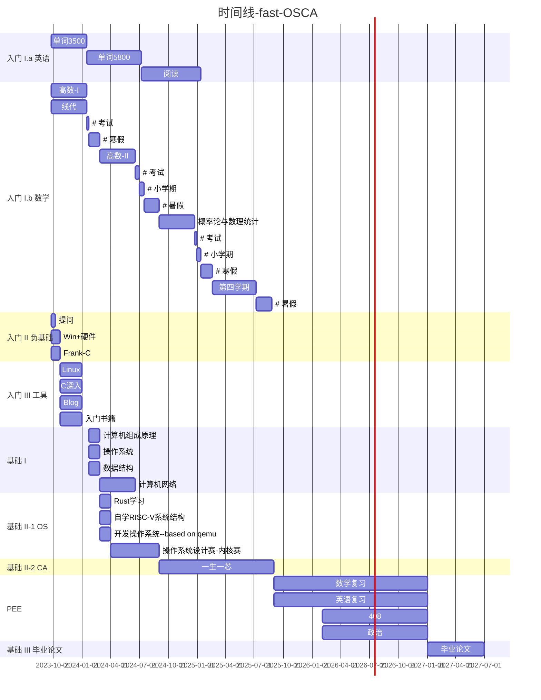
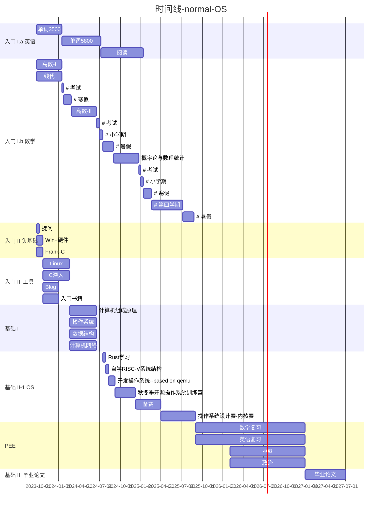
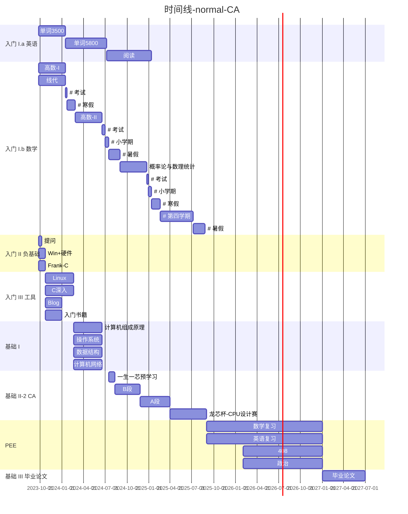

```mermaid
gantt
    title 时间线-fast-OSCA
    section 入门 I.a 英语
    单词3500  : 2023-09-25, 16w
    单词5800  : 25w
    阅读		: 27w
    section 入门 I.b 数学
    高数-I	: 2023-09-25, 16w
    线代 		: 2023-09-25, 16w
#   考试: 1w
#   寒假: 5w
    高数-II	: 2024-02-26, 16w
#   考试: 2w
#   小学期: 2w
#   暑假: 7w
    概率论与数理统计: 2024-09-02, 16w
#   考试: 1w
#   小学期: 2w
#   寒假: 5w
    第四学期: 20w
#   暑假: 7w
    section 入门 II 负基础
    提问	: 2023-09-25, 2w
    Win+硬件: 2023-09-25, 4w
    Frank-C	: 2023-09-25, 4w
    section 入门 III 工具
    Linux: 2023-10-23, 10w
    C深入: 2023-10-23, 10w
    Blog: 2023-10-23, 10w
    入门书籍: 2023-10-23, 10w
    section 基础 I 
   	计算机组成原理: 2024-01-22, 5w
   	操作系统: 2024-01-22, 5w
   	数据结构: 2024-01-22, 5w
    计算机网络: 2024-02-26, 16w
    section 基础 II-1 OS
    Rust学习: 2024-02-26, 5w
    自学RISC-V系统结构: 2024-02-26, 5w
    开发操作系统--based on qemu: 2024-02-26, 5w
    操作系统设计赛-内核赛: 2024-03-31, 22w
    section 基础 II-2 CA
    一生一芯: 2024-09-02, 364d
    section PEE
    数学复习: 2025-09-01, 16M
    英语复习: 2025-09-01, 16M
    408: 2026-02-01, 11M
    政治: 2026-02-01, 11M
    section 基础 III 毕业论文
    毕业论文: 2027-01-01,6M
```

```mermaid
gantt
    title 时间线-normal-OS
    section 入门 I.a 英语
    单词3500  : 2023-09-25, 16w
    单词5800  : 25w
    阅读		: 27w
    section 入门 I.b 数学
    高数-I	: 2023-09-25, 16w
    线代 		: 2023-09-25, 16w
#    考试: 1w
#    寒假: 5w
    高数-II	: 2024-02-26, 16w
#    考试: 2w
#    小学期: 2w
#    暑假: 7w
    概率论与数理统计: 2024-09-02, 16w
#    考试: 1w
#    小学期: 2w
#    寒假: 5w
#    第四学期: 20w
#    暑假: 7w
    section 入门 II 负基础
    提问	: 2023-09-25, 2w
    Win+硬件: 2023-09-25, 4w
    Frank-C	: 2023-09-25, 4w
    section 入门 III 工具
    Linux: 2023-10-23, 17w
    C深入: 2023-10-23, 17w
    Blog: 2023-10-23, 10w
    入门书籍: 2023-10-23, 10w
    section 基础 I
   	计算机组成原理: 2024-02-19, 17w
   	操作系统: 2024-02-19, 17w
   	数据结构: 2024-02-19, 17w
    计算机网络: 2024-02-19, 17w
    section 基础 II-1 OS
    Rust学习: 2024-07-15, 2w
    自学RISC-V系统结构: 2w
    开发操作系统--based on qemu: 4w
    秋冬季开源操作系统训练营: 13w
    备赛:16w
    操作系统设计赛-内核赛: 2025-03-31, 22w
    section PEE
    数学复习: 2025-09-01, 16M
    英语复习: 2025-09-01, 16M
    408: 2026-02-01, 11M
    政治: 2026-02-01, 11M
    section 基础 III 毕业论文
    毕业论文: 2027-01-01,6M
```

```mermaid
gantt
    title 时间线-normal-CA
    section 入门 I.a 英语
    单词3500  : 2023-09-25, 16w
    单词5800  : 25w
    阅读		: 27w
    section 入门 I.b 数学
    高数-I	: 2023-09-25, 16w
    线代 		: 2023-09-25, 16w
#    考试: 1w
#    寒假: 5w
    高数-II	: 2024-02-26, 16w
#    考试: 2w
#    小学期: 2w
#    暑假: 7w
    概率论与数理统计: 2024-09-02, 16w
#    考试: 1w
#    小学期: 2w
#    寒假: 5w
#    第四学期: 20w
#    暑假: 7w
    section 入门 II 负基础
    提问	: 2023-09-25, 2w
    Win+硬件: 2023-09-25, 4w
    Frank-C	: 2023-09-25, 4w
    section 入门 III 工具
    Linux: 2023-10-23, 17w
    C深入: 2023-10-23, 17w
    Blog: 2023-10-23, 10w
    入门书籍: 2023-10-23, 10w
    section 基础 I
   	计算机组成原理: 2024-02-19, 17w
   	操作系统: 2024-02-19, 17w
   	数据结构: 2024-02-19, 17w
    计算机网络: 2024-02-19, 17w
    section 基础 II-2 CA
    一生一芯预学习: 2024-07-15, 4w
    B段: 15w
    A段: 18w
    龙芯杯-CPU设计赛: 2025-03-31, 22w
    section PEE
    数学复习: 2025-09-01, 16M
    英语复习: 2025-09-01, 16M
    408: 2026-02-01, 11M
    政治: 2026-02-01, 11M
    section 基础 III 毕业论文
    毕业论文: 2027-01-01,6M
```

