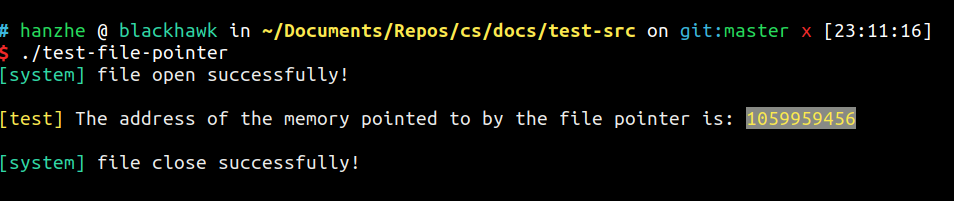

# 简介

> ### **下方有<a href="#update">更新记录 </a>**

主站：[浩哈哈哈哈--网管儿，来碗泡面！](https://haohaha.cn)

主要在这里更新每日学习记录，打卡群里也有一份。

日常更新目录：

- 考研部分：

    - 每日墨墨 + 每日2h+英语阅读精读

    - 数学学习（高数/线代/概统）

    - 408王道写题 + 错题

- 实践学习：

    - [每1-2周一章rCore实验笔记](https://os.haohaha.cn)

    - ["一生一芯"进度]()

- [美食记录](https://chat.haohaha.cn/delicious/cook)（在“闲聊波尔卡”栏目里，不定期更新）

---

但行好事，莫问前程。

对，就是**莫问前程，问就是回家卖馒头。**

考研人的最后一点脸面还是要留的，是吧。

考上再说，考不上也再说。

---

## 更新记录

20230801更新：

> 建军节！致敬~

- 墨墨30

- 数学本来应该有，但是无——吃火锅了。

- 408：

    - 数据结构基础课04+配套王道习题 - 错误率(6/44)，已解决错题。

来了帮忙打煤气管道的师傅，于是尘土飞扬满厨房。

请老妈来帮忙弄弄，于是晚上吃了顿好的——对，又是涮羊肉，哈哈哈哈哈

---

20230731更新：

> 似乎存在一个碳基生物诞生于今日。
>
> 你是不能忘记的人……你是？（乐）

- 墨墨30

- 数学本来应该有，但是无。

- 408：

    - 数据结构基础课03+配套王道习题 - 错误率(10/58)，已解决错题。 

哎呀，今天起晚了还是。

焦虑到晚上，但是洗了个澡就安静下来了。

把今天听得树-1的题解决掉啦，基本都能做的对呢。

哎，还是得勤奋一点吼？

总是想着偷懒还是不太好的吼~

---

20230730更新：

- 墨墨30

- 数学无

- 408：

    - 数据结构基础课02+字符串 

    - 数据结构强化课02

三节课好多好多知识，本来能做完习题的……但是昨天晚上只睡了三四个小时，中午睡多了就赶不上干活儿了。

于是整理了一下下周的[作业和任务](http://chat.haohaha.cn/plan/Week-Plan/)，[更新一下阶段规划](https://github.com/Haohahahaha/chat/commit/ccc89b2fb93e6b4a814e7463ba73f37d28f435cd)（主要是把每周开始时间调至周一）。  

---

20230729更新：

- 墨墨30 

- 数学无

- 408：

    - 数据结构基础课01+配套习题 

        - 定义法计算时间复杂度 - 错误率(3/30)

        - 线性表选择题+作业题 - 错误率(5/36)

    - 数据结构强化课01+作业题 - done

再次[更新计划](https://github.com/Haohahahaha/chat/commit/d82c264c16dcaaa016b88ef356ff4d13a20e2be2)，看了看课时安排。我重新安排了一下我复习计划，二模之前我争取把进度追上。

天道酬勤。

---

20230728更新：

- 墨墨30

- 数学：

    - 线代：第二章学完

    - 高数：强化开课……看了看2022数一真题，发现好多概念还没学，狂补中。

- 一生一芯：完成“笨方法学C”练习1-3，花了4个小时，主要再看manual和写[验证程序](https://github.com/Haohahahaha/Hz-ysyx-learning/commit/23762e440f330cf331c8a1e88c22a22ad57d5e7d)。

学数学有点疲……就是不太想学但是精神头还是在的。估计可能是杨威老师的视频风格我有点“高原反应”吧（但是讲的真的很很很到位，很好），换回杨超的高数强化，就舒服多了。

实在懒得学数学了，就做做一生一芯，省的浪费时间。

明天开408强化啦，我捎带基础课一起听吧！

数学进度还是慢了，这几天还是比较耽误时间了，那就把任务往后稍微放一点，[更新计划了](http://chat.haohaha.cn/plan/PEE-plans/)。

---

20230727更新：

- 墨墨30 

朋友来了有好酒。

朋友走了累成狗：我还不敢早睡，怕半夜醒来作息又坏了，于是——

我坐在椅子上昏昏沉沉了20分钟。

这种感觉……似曾相识——大概是两三年前在学校图书馆学得累到打盹，醒来之后继续学习的感觉吧。

该有这种感觉，尽管总是这样会导致我一直绷紧弦儿，过度疲劳……

可又有什么不可以呢？

醒来，脑海中浮现出一句话：

> I have NOTHING, so I have EVERYTHING.
>
> 我知我无，便知我有。
>
> 既知命途，则无驻足。

好啦，家都收拾干净了，也洗完澡了，我睡了。

---

20230726更新：

- 墨墨30

- 线性代数第二章，完成例题，习题两道。

今天老妈来聚餐，吃饭当然就放松了些。

又商量到去北京看看各种博物馆，嗯，有意义。

明天朋友来，休息半天。

---

20230725更新：

- 墨墨30

- 线性代数第二章，完成概念。（截至23：50）

黑夜变白天了，今天夜里推一下进度吧，不然也睡不着。

---

20230724更新：

- 墨墨247

- 线性代数第一章，完成概念、例题、练习题7道。

今天学习时间才6.25H，不足。

本来想再晚点，但是我发现衣服要整理一下，那就明天继续继续。

诶呀呀，我觉得还是有希望的。

加油干。

---

20230723更新：

- 墨墨30

墨墨30 今天在考试。余下时间在学线性代数。晚上又睡着啦。

我知道我目前状况，就是因为我没有拿出应有的精力来复习。

前几个月折腾来折腾去，想想，阶段性测试的结果也就不足为奇。

好吧，那么既然从现在开始没什么事情打扰自己了，咱就加把劲儿——

把以前差的补回来吧。

---

20230722更新：

- 开线代了，第一章学了一半，明天提速。

- 英语：墨墨30

一模了，但我还没准备好，所以我准备下周答题。

有同学一模都145了我草……

还是得加把劲儿啊睿。

---

20230721更新：

- 英语：墨墨30

过于兴奋以至熬到今天早上十点才睡得着。

下午两点醒来吃完饭就去移动办业务了。

看了碟中谍7，很好看！镜头啊，配乐啊，还是很棒滴！

（虽然我还是觉得吃着爆米花更配，嘿嘿）

夜安，早点休息。

---

20230720更新：

- 英语：墨墨900

今天和高中同学聚会！

---

20230719更新：

- 数学：

    - 三大计算完结

    - 整理好电子书的书签

- 英语： 墨墨30

今天把数学弄完了，不容易不容易——也说明只要肯做，没什么做不完的，也没什么来不及的。

但是好累，晚上八点多就睡着了……555。

明天请假。

---

20230718更新：

- 数学5.5h：完成分部积分法求积分部分，距离三大计算完成还差一天。

- 英语：墨墨168

虽然十二点才起，但是我干得多啊！

晚安。

---

20230717更新：

- 408 dsa 2-1 2-2习题

- 数学1.5h：分部积分法开头

强者从不抱怨环境，但若小学生贴着你`写数学的iPad`进行`玩玩具`动作，并看你躺下休息脑子时说出`不应该在实验室休息，应该回宿舍`，阁下该如何应对？

闪击唐山。

回家蒸了包子，做了豌豆黄，真好吃。

就是蒸包子蒸到半夜，下次不蒸那么多了。

---

20230716更新：

- 墨墨600

- 数学5h，解决换元法求积分

- 一生一芯：完成第二节课的学习

无导师制堪称世界上的伟大壮举。

---

20230715更新：

- 英语：墨墨600

- 一生一芯：参加预学习交流会，学习Missing Semester `Lesson 2`

还是中午起来，那怎么办呢？

答案就是：火速返校。

晚安。

---

20230714更新：

- 英语：墨墨300

- 数学： 换元法求积分强化篇2

- 408：无

- 一生一芯：学习Missing Semester `Lesson 1` && `tmux`

还是中午起来了，傍晚又睡了一小会。

一模倒计时7天，强化倒计时14天。

---

20230713更新：

- 英语： 墨墨50

- 一生一芯： 查看[计算机教育中缺失的一课](https://missing-semester-cn.github.io/)，简单了解，其实对我来说这些东西蛮熟悉的，学起来也不会太慢。真棒。

今天在备餐，做的小馄饨和香菇油菜包（吃完忘了拍照了……），还炖了黄焖鸡，做了照烧鸡腿（鸡腿不能用盐水泡太久，不然真的会咸）。

老妈过生日，我一口蛋糕都还没来的及吃，自己喝进去的一瓶半啤酒就足以让我去床上休息了。

喝多啦，自己都能喝多了，真是有趣。

晚安！

---

20230712更新：

- 英语：

    - 墨墨300

    - 精读一篇

- 数学：无

- 408：

	- 操作系统4-2 4-3……

- 一生一芯： 通过查询man，了解并写出一个关于文件系统的测试文件。我通过写出此程序，理解了操作系统中文件系统的各个知识点，如：索引。我同时还查看了一些相关的网页，如[rCore-Tutorial-v3](http://rcore-os.cn/rCore-Tutorial-Book-v3/chapter6/3using-easy-fs-in-kernel.html)，略读了一篇[关于持久化内存的论文](http://storage.cs.tsinghua.edu.cn/papers/iccd14-loc.pdf/)和OS内核赛优秀作品的文档。

  

运动效果显著：肩颈疼痛情况有所缓解。

睡眠效果显著提升。

一点遗憾就是早上时间没有利用的太好。

---

20230711更新：

- 英语：

    - 墨墨300

    - 精读一篇

- 数学：无

- 408：

    - 操作系统4-1（做得慢啦……）

- 一生一芯：无

今天开始做运动+睡前远离电子设备了。

--- 

20230710更新：

- 英语：

    - 墨墨300

    - 精读一篇

- 数学：
    
    - 换元法求积分强化01

- 408：

    - 操作系统复习 day-1

- 一生一芯：
    
    - 参与第一次课

今天干的不算太多。

有点发愁做饭的事情，有点懒得做了——

虽然还是看了蒸包子和包馄饨的教程，嘿嘿，不做不行啊。

起得晚，十一点才开始学；收拾厨房，出去走了走，这些主要耽误了些时间。

还是早点睡吧我。

---

20230709更新：

- 墨墨152

- 数学：无

- 408：无

今天和好朋友聚了一天，就背了背单词。

> 夜里の小感慨：
>
> 人啊，大概还是要放下遗憾，向前看，别回头吧？
>
> 可真的面对选择，我总是会犹豫。
>
> 就算是向往的那个洒脱的东坡先生，大概他也会有遗憾的感受吧？
>
> ...

---

20230708更新：

- 墨墨211

- 数学：换元法求积分基础部分、

- 408：听了一小会计网课

今天睡得很多，下午才开始干活儿。

但是今天我和飞哥一起想了个办法——互相开腾讯会议学习。

效果很显著！！！

嘿嘿。

想了想，后面也有直播的需求，晚上就在搞直播间配置+物理世界配置。

弄好了，也夜里十二点了。

明天先试行半天，下午晚上有约，和好哥们聚聚。

晚上做的[鸭架白菜汤泡饼](http://chat.haohaha.cn/delicious/cook/#20230708)，香极了~

晚安，这下效率调整回来了，我就开心了。

---

20230707更新：

**七七事变，勿忘国耻。**

- 墨墨238

- 数学：无

- 408：无

今天的时间利用率好令人崩溃。

上午就背了单词，去楼下菜市场买了三个鸡腿（划重点）、半只烤鸭和三个洋葱。

中午吃的是烤鸭拌饭。

晚上就做了[黑胡椒鸡腿饭](http://chat.haohaha.cn/delicious/cook/#20230707)。

午睡还睡得有点多，时间就所剩无几了。

要么是躺着，要么泡在厨房。

傍晚在弄一生一芯的学习——PA0，弄好了，我计时一共7h，按照[标准](https://ysyx.oscc.cc/docs/ics-pa/FAQ.html#%E6%88%91%E5%8F%91%E7%8E%B0%E8%87%AA%E5%B7%B1%E5%81%9Apa%E7%9A%84%E7%94%A8%E6%97%B6%E6%98%8E%E6%98%BE%E5%A4%A7%E4%BA%8E%E8%AE%B2%E4%B9%89%E4%B8%AD%E9%A2%84%E4%BC%B0%E7%9A%84%E6%97%B6%E9%97%B4)来算的话，也算是个“编程基础扎实”的同学了吧？

嘿嘿，当然，我知道我好多好多还没学呢，以前为了麻烦+英语不好，没学 `gdb` `tmux` `man` `MIT Missing Semester`，啥都不会捏。

回家四天了，效率还提不上来，我就得考虑润回学校了，就算墨迹一点，费钱一点，在关键时刻还是得保证效率和产出哇。

我都做了两天考不上的梦了，这也算是个警示吼。

明天试试直播学习，我配完环境睡觉。

---

20230706更新：

- 墨墨231

- 高数：积分第一节剩余部分（主要涉及三角函数公式）完成。

- 一生一芯：安装Ubuntu22.04，并进行了一部分的配置。

今天的作息也不好。睡了回笼觉，十点醒了就出了事情，我又没把握好自己的情绪（或许是某种创伤吧）。

那么一整天的状态都差的不得了。

试图麻醉自己，麻痹自己，让自己继续学下去。不过也就学了这么多吧，很少。

傍晚睡到夜里十点，还是做梦，梦到自己参加高中考试，还是没有考上。

因为我复习到一半之后还是因为精神问题摆烂了。但我考的也没有差多少，梦里，我甚至对自己还有点满意。

不过，在梦里，我也无奈地说，“不行就再来一年，或者再来三年，我重新考就是了”。

哎，还是一个考不上的梦。

但是醒了之后想了想，发觉自己之前不够成功的原因是总会逃避面对最主要矛盾。

那么我这次就直面它吧，毕竟直面所遇到的痛苦也未必要比逃避多嘛！

嘿嘿。

哦对了，我报名CCF Sys2023了，下月初去南昌看看，嘿嘿。

那么除去报名费以外剩下来的——这个月的伙食费，我希望我能再省下来不少，然后我还可以发一些我的成果到美食栏目里呢！

---

20230705更新：

- 墨墨182

- 高数总结反三角记忆小卷

- 一生一芯文档看了4h，甚合我意！

下午睡大了，还是好困。我做了一个考不上的梦。

好吧，小测前还是要努力一下，为了强化阶段之前打好基础。

---

20230704更新：

- 墨墨89（现在每天必须要复习的数量好少，真不错，嘿嘿）

- 一生一芯的任务——写“提问的智慧”读后感

今天是休息的一天，不然身体真的遭不住。

今天吃的是[自己炖的黄焖鸡耶！](http://chat.haohaha.cn/delicious/cook/#20230704)

---

20230703更新：

- 墨墨601

- 高数：积分第一节+总结了三角函数和积分公式的记忆小卷。

- 英语精读一篇

晚上回家实在没力气了，没做408就睡着了。

---

20230702更新：

- 墨墨605

今天一天去参加“一生一芯”启动会了，我报名啦。

以后的每天学习时间变成了保证备考考研8h+一生一芯4h。

---

20230701更新：

- 墨墨228

- 数学无

- 408无

早起倒是早起了，七点45就起来了，但是忙了一上午其他事情（报了个CCF Sys去听，明天回京去计算所参加一下第六期一生一芯的活动）。下午组装桌子，挪书架，做水吧，[书房终于像样一些了](http://chat.haohaha.cn/construction/construction/#20230701)。很累，抓着时间把墨墨过了。我今天早睡，明天还是继续早起哈。

---

20230630更新：

- 墨墨162

- 数学开积分第一节

- 408没做

[做了清炖牛肉+红烧牛肉](http://chat.haohaha.cn/delicious/cook/#20230630)，做饭有点累，晚上还睡了一大觉。在家最重要的，就是早起。

明天保证早起！

---

20230629更新：

- 墨墨605

- 高数 总结导数表和麦克劳林公式，写了测试卷以便加强记忆。

- 408 计网 3-5

因为今天上午腰疼，所以学习时间少了一点，5小时。

晚上终于想起来该怎么宣传新队伍了，嘿嘿。

---

20230628更新：

- 墨墨298 

- 高数 变限积分求导 高阶导数（至此，三大计算求导数完成）；

- 408 计算机网络 3-4 

算信道利用率不太好，于是多学了数学。

晚上和实验室小辈认真交代一下暑假的事情，聊的蛮开心。

---

20230627更新：

- 墨墨607

- 高数分段函数求导

- 408 计算机网络 3-1 3-2 3-3

晚上去吃饭，汤臣小厨真好吃。

---

20230626更新：

- 高数参数方程求导数

- 墨墨608

- 计算机网络数据链路层第一节课2h

今天学习状态很好，重点转移了，放在数学和408。

我打算继续保持！

---

20230625更新：

- 概统开始推进度了！

- 墨墨605

晚上实验室开会，学期末有点忙！

---

20230624更新：

- 墨墨500

---

20230623更新：

- 墨墨90

今天去理发啦！

一直在写材料，写啊写，写到半夜两点哩。

---

20230622更新：

- 墨墨50

收拾东西和好好休息。

吃了药，第二天的效果约等于消除记忆，真棒。

---

20230621更新：

- 墨墨206

- 只是在早上休息了一会，一整天都在忙。

收拾书，收拾家，累啊累。

吃了两片劳拉西泮才顶住……

---

20230620更新：

- 墨墨666

实验室开了个小会。

内耗极大。

---

20230619更新：

- 墨墨112

- 看完rCore第二章

总结了一下，三年的经历浓缩成真的计算机的学习路线，颇为感叹。

---

20230618更新：

- 墨墨805！过完一遍考研大纲单词啦！

- 听一晚上计网，脑袋有点大。

明天小学期开始，我去忙一下。

---

20230617更新：

- 墨墨700！

- 认真听了M佬的课，真好，计网的体系都帮我捋顺了。

---

20230616更新：

- 墨墨401

今天踏踏实实休息休息！

哎呀，终于考完啦。

继续满怀希望的复习吧！

---

20230615更新：

- 墨墨348，纯复习

- 编译原理复习！

天安门城楼真好看～

紫光园真好吃，又实惠！

MESSI！2-0！

---

20230614更新：

- 墨墨390，纯复习

- 概率论与数理统计复习

其实是考前突击啦～

---

20230613更新：

- 墨墨330

图图姐做的饭，看着就好吃捏！！！

---

20230612更新：

- 墨墨400

做了一天饭，晚上九点半弄完就累死睡着了。

---

20230611更新：

- 墨墨768

明知道自己要节省，但还是嘴馋，点了两份黄焖鸡吃。

yummy！

嘿嘿。

说实在的，我效率上不去的最大原因是内耗。拜家庭所“赐”，我的情绪模式很差劲，控制欲强，焦虑感强，也再不想和任何亲人打交道了（这一点不用克服）。我很想努力克服困难，可是克服了很久很久，尽管有改观，但还不如前几天那一片药的药效改变的大。吃完那片药，我虽然乏力，反应慢和记忆力减退了，但是我确实是体验了一下一个正常人的情绪模式，至少我不会被情绪所困。哎呀呀，都六月了，吃药也耽误学习，不吃药内耗还耽误学习，这确实让我很烦恼。我想想办法吧，大概还是得拿出一小部分时间来修复内耗，这阶段还是顺着自己的精力和生物钟走，稳定为主吧。

赶紧学概统了。

---

20230610更新：

- 墨墨30

休息的一天？

不，其实是在做软工的大作业啦。

半夜内耗5h，真让人烦恼。

---

20230609更新：

- 墨墨700

[回家蒸馒头咯！](https://chat.haohaha.cn/delicious/cook/#20230609)

---

20230608更新：

- 墨墨500

- 概统一个半小时

上午听了听研究生毕业答辩，一个小时，感觉本校水平也就这意思啊……

下午临上概统课之前听了jyy直播课（[录播课在这里](https://www.bilibili.com/video/BV1gM4y1Y7nd)）半个小时，颇有感慨。

蒋老师说的这些我何尝不明白呢……囿于生活，我想我只能尽力做到把毕业和追求理想平衡起来吧……在当下的规则下，也只能这样玩啦……不过话说回来，我还真没有觉得有什么更好的办法去改变这样的规则，毕竟这就是目前的最优解。如果有厉害的小伙伴有朝一日找到一套既能让学生坚定理想不懈追求又能不让其被无谓的课业所累的规则（当然，我说的是适用于绝大多数学校），那我想我们中国的面貌会焕然一新吧。也许提高了生产力，这样的规则也就自然浮现出来了吧……期待。我还是脚踏实地，努力奋斗吧，嘿嘿。

傍晚快下概统课的时候（大概16:45）开始内耗，脑袋大。一直到我回了本校都18:30了还脑袋大。回宿舍找到两年前去医院开的劳拉西泮，到实验室服了一粒（0.5mg），就开始犯困……八点半睡到九点半，醒了之后乏力、镇静、语无伦次、反应慢、语无伦次，但是不脑袋大了，想了一圈难过的事情也不脑袋大了，情绪回到了正常人的状态……感觉真好，就是吃完药还是耽误学习。继续背单词背到了676个。

半夜都上床了，和朋友还打了个电话，哎呀，我反应慢，反应慢呀QwQ……

依旧是和舍友聊到困死再睡。

---

20230607更新：

- 墨墨700！

- 概统一小时

学了一个博客，是[关于用vim快速写LaTeX的](https://castel.dev/post/lecture-notes-1/)，非常不错！

最近背的单词也都用上了，阅读英文博客的速度快了些，真好！

> 但其实内耗太大了，如果我没有局限于只背700的话，我今天应该能背1500……内耗太大了。
>
> 我哪知道阻碍我进步的是我的情绪模式呢？

---

20230606更新：

- 墨墨500！（新学110）

- 概统俩小时，感觉很简单啊！

晚上和林学长高歌几曲，品尝美食，指点江山，激扬文字。

很开心！想想自己也要大四了，也就快考研啦！加油加油！

---

20230605更新：

- 墨墨500！（新学单词0，估计是在巩固中）

- 高数参数方程求微分练习

- 阅读CSAPP第一章完毕

给舍友讲了一个半小时计组+操作系统的概论，帮他入门and搭建知识框架。当然我自己在讲的过程中也巩固了知识。

然后脖子和腰就受不了了，回宿舍七点睡到十一点，两点躺下又睡了。

---

20230604更新：

- 墨墨50...

- 高数：参数方程求微分

今天缓一天，发现该背单词的时候已经凌晨了。早点睡，明天还赶车。

---

20230603更新：

- 墨墨500！

一到家里就睡多啦。身体真的好累，不过还是不能休息滴，要坚持下去滴。

> 说起来，在家的自律性还是不够，很多时间没有按照学校的作息和习惯走，**容易放纵自己**，就会让自己“生物钟”紊乱，导致效率降低。
>
> 所以在家也要坚持自律啦。

---

20230602更新：

- 墨墨500！

在家持续肝模式，不错不错，最起码在家能保持状态啦！

其余时间在弄财务规划，写[建设清单](http://chat.haohaha.cn/construction/construction/)。

---

20230601更新：

- 墨墨500！

回家之后洗漱，吃了今天的第一顿饭。

吃完饭都六点半啦，好累，从晚上七点多睡到半夜三点多，又从五点睡到十一点。

> 其实， `坚持==胜利` ，但另一面则是： `停下来==死` 。
>
> 也许我正在进行着独属于我自己的长征吧。
>
> 注：因为时间就这么多，如果休息多占用了时间的话，完成规划的时间就不够用了。有的时候我也能把自己的弦儿绷断了，比如大一的时候，睡不好，累到肩膀疼后背疼，经常抱着书包去十三号线上从西直门睡到东直门……哈哈，当然，主要也是我身体素质不行吧（挠头+嬉皮笑脸），在锻炼啦！

---

20230531更新：

- 墨墨500！

听了一下午大四的毕业答辩……只能感慨一下时光荏苒啦，19届的林学长也即将毕业了，我也马上大四了，时间真快呀。

基本完成实验室博客的教学了，还差写实验室文档，周一回学校赶紧弄完啦。

---

20230530更新：

- 墨墨500词

- 王道操作系统2-3（正确率80%）

累死。

---

20230529更新：

- 墨墨500词

- 王道操作系统2-1(51/58)，2-2(30/33)课后选择题

- 探索博客工具使用

今天一天真充实呀！

---

20230528更新：

- 墨墨250词

- 晚上跟操作系统课

今天内耗极其严重，还耽误了最早一班去京的火车。心脏累到跳不动了。

---

20230527更新：

- 墨墨30词

把自己的屋子收拾的干干净净，真好。

---

20230526更新：

- 墨墨300词

坚持打卡一个月啦！

今天输了21个小时。

---

20230525更新：

- 墨墨50词

光速逃离毒圈，回家了。

---

20230524更新：

- 墨墨220词

- 数学：隐函数求导

- 408：操作系统讲义预习完毕，准备写一篇博客输出。

---

20230523更新：

- 墨墨500词

在学校把某一门课的大作业写完了，所以有点耽误时间。

---

20230522更新：

- 墨墨200词

今天在搞编译原理的实验啊，有点搞不太懂了，有点晕。

理发啦！

---

20230521更新：

- 墨墨100词

- rCore实验

发烧了，但坚持坚持，截至0522早六点，已经退烧了。

我发现，每当进入状态的时候，总会来一场发烧：挺过去了，状态就保持住了，挺不过去，可就得重新来。

---

20230520更新：

- 整理电子设备内的所有数据

- 零壹——操作系统课第一节

今天的状态好，但是呢，在大开工前，我要认真地整理好我的数据！

所以搞了一下午，又是导照片又是导文件的。

忙来忙去。开始新的阶段吧！

---

20230519更新：

- 墨墨100词

一整天状态极差，做的东西太少啦。

---

20230518更新：

- [博客维护教程-文案工作部分](http://cs.haohaha.cn/greenhand/Blog_Maintainance_CW/Blog_Maintenance-Content_Workers/)

- 墨墨200词

回家之后吃完饭洗完澡，躺在床上睡着了，十点才醒。阿啦啦啦。赶紧更博客来啦。

晚安！

---

20230517更新：

- 弄学校实验室博客，学会了git团队协作的入门，分支合并与管理等。

- 墨墨300词

---

20230516更新：

- 墨墨300词

- 一直在搞学校大作业，忙不过来。

下午休息了一会儿，晚上和朋友们聚餐呀！

---

20230515更新：

- 墨墨500词

- 数学三大计算：求导数2-2，复合函数求导

- 学校博客

---

20230514更新：

- [Ubuntu2204 虚拟机搭建全流程](http://cs.haohaha.cn/greenhand/Ubuntu2204-greenhand/)

---

20230513更新：

- [rCore Chap.2 实验进度60%](https://github.com/Haohahahaha/Hz-oslab-rCore/commits/ch2)

---

20230512更新：

- [rCore Chap.2 实验进度40%](https://github.com/Haohahahaha/Hz-oslab-rCore/commits/ch2)

---

20230511更新：

- 王道 arch 3-5习题

---

20230510更新：

- 墨墨300词

- 配置实验室博客

- 做学校大作业

晚上临下课遇到点事情。

---

20230509更新：

- 墨墨50词

今日学校有事情，再加上赴约，于是学习时间少了。

---

20230508更新：

- 墨墨200词

- 政治课1节

- 做学校大作业中...

---

20230507更新：

- 算法：[删除字符串中的所有相邻重复项](https://alg.haohaha.cn/CodeThinker/7/2023-05-07_7-5)

- 编写Ubuntu 2204 安装教程

---

20230506更新：

- 计组学习

昨天累着了，一觉睡到十一点，醒了身体就没事儿了。把桌面恢复原样搞到四点半，我的移动固态硬盘到了，这样我就可以把我所有的学习资源放在一个硬盘里了。现在我直接用虚拟机跑所有软件，因为有很强的主机，我就只需要带一块 `2000+MB/s` 的移动固态就好了。然后就正好开始听M佬讲课。今天没有日常打卡，明天正式恢复正常。

---

20230505更新：

- 算法：[有效的括号](https://alg.haohaha.cn/CodeThinker/7/2023-05-05_7-4)
- 英语精读02
- 墨墨160词

晚上刚整理事情就发现洗衣机排水没弄好全屋被淹，我电脑拆了，桌子也搬走了，一时难恢复原貌，明天后天我想想办法，尽力吧。

---

20230504更新：

- 英语精读01

今天研究了研究英语数学408 的 复习流程，整理好了。

然后不知道咋回事儿，九点竟然睡着了，半夜才醒。

---

20230503更新:

- 墨墨150词

- 数学三大计算：求导数-2.3（无笔记）

今天恢复回来了。

没来及做算法，没关系，明天继续。

有的时候懒得截图，但是不截图就看不出我做啥来，哈哈。

三大计算这个基础只要想打，能打的特别牢。我看我自己导数表背的也不太好（尤其是三角函数），自己做了一个小卷子，时不时拿出来默写一遍，就能记得牢了。可能以后还有一些推导要日常默写吧，后面再加。 

---

20230502更新:

- 墨墨100词

今天好累啊，好累。

去电子城搞了一块屏幕，85元。1600x1050，21.6吋。

还是比较模糊，无奈。

然后继续加油吧。

今天休息好了之后，明天继续干。

---

20230501更新：

- 墨墨300词

- 数学三大计算：求导数-2.2（没有笔记）

- 算法：[代码随想录 7-5 逆波兰表达式](https://alg.haohaha.cn/CodeThinker/7/2023-05-01_7-6)

今天我再看看视频，还是要学习一下精读和知识点讲解怎么搞。

---

20230223更新：nwk 3-1 3-2

操作系统3-2啃不下来（其实是懒，最近开学才勤快起来），

在学校看王道网络感觉，“嗯，这个蛮简单的”，一口气看了第三章和第四章的一半。

先更一节，这几天我快搞搞，主要是数学还没咋开，好歹得留点时间给数学。

---

20221216更新：os 2-2

月初至今，去医院跑了好几趟，去商场跑了好几趟。

阳了好几天，今天刚好些，心情烦闷，一口气把2-2剩余的一些部分写完了。

希望大家都好好的。

---

20221203更新：arch 1-2 5-4 5-6 (另，os 2-1补图例)

芜湖，组成原理的图终于做完了，很开心！

加油干啊！

还有两本书，胜利在望（坏笑）

---

20221201更新：os 2-1

这一节内容也是忒多了点，磨磨蹭蹭做了三天。

> 风波的余波仍存，我争取变得更好。

---

20221123更新：os 1-6

一个风波过去了，我继续。

---

20221107更新：os 1-5

简单更一章。

---

20221106更新：

- morning：arch 7-3

> 一节更比四节强，有点多。

---

20221105更新： arch 1-1 1-3 7-1 7-2

快了快了，胜利就在前方。

---

20221104更新：arch Chap.6(6-1 6-2)

---

20221103更新：arch 5-2 5-3 5-5 5-7

先更这么多，明天继续，争取这两天把arch这本书做完。

---

(1103凌晨更新：顺手做了5-1，希望第五章快点搞完。)

20221102更新：arch 4-3 4-4

在泥泞的4-3里挣扎了两天之后，4-4就像吹一口气一样，捎带着写完了。

明天Chap. 5，希望我能多写点，下午别睡三个小时了。 

---

20221031更新：arch 4-1 4-2

存储部分已完成，开CPU部分。

> 存储部分：
>
> - arch chapter 2 && 3
> - os chapter 3 && 4 && 5-3

---

20221020更新：

由于本人开始备考计算机研究生啦，所以本版为主要板块，更新也比较频繁啦！

我在用王道23的四本书，0轮复习，做思维导图中。

目前板块：存储器，

下一版块：处理器。

四本书的思维导图将于2022年12月10日更新完毕，敬请期待。

之后的计划待定。

---

20220703：

这里将记录我学的一些CS知识（OS相关除外）。我主要会将我学到的知识写成CookBook的形式，以便自己和大家查询使用。

敬请期待哦～
