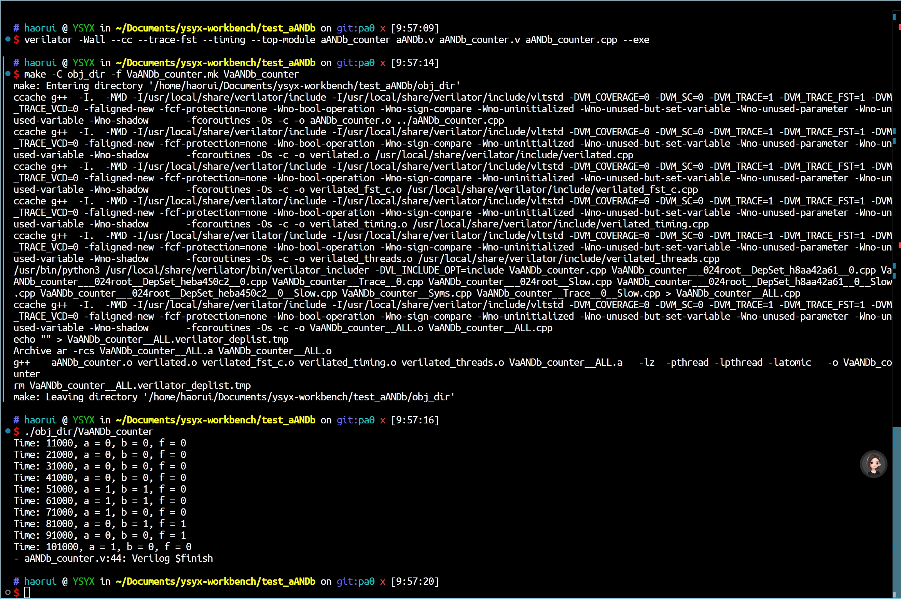

# 03月27日 - 预学习

!!! success "今日学习"

    1. 预学习 - [5. 搭建 verilator 仿真环境](https://ysyx.oscc.cc/docs/2306/preliminary/0.4.html)

    > 注：链接首选为讲义，其次为视频。

!!! tip "阅读树"

    - [讲义](https://ysyx.oscc.cc/docs/2306/preliminary/0.4.html)
        
        - [Verilator Installation](https://verilator.org/guide/latest/install.html)
        
        - [Verilator Example C++ Execution](https://verilator.org/guide/latest/example_cc.html#example-c-execution)

!!! note "笔记"

    !!! info "生成 FST 文件有一点点小曲折，但是成功了"

        - 我用豆包辅助 + 自己理解修改做好的。
        
        - 思路：
            
            1. 分两个文件写模块，一个模块是核心模块，另一个是调试模块。
            
            2. 组合逻辑电路只会根据 信号输入频率 生成 输出信号， 而时序逻辑就需要一个时钟生成模块了。
            
            3. 使用 `$dumpfile` 系统任务指定波形文件名为 `counter.fst`
        
        - 其余的笔记我都写在代码注释里了。 

        成果截图如下：

         

    !!! info "NvBoard 跑起来了，为了以后写着方便，目前简单写一下自己的操作理解"

        - ⚠ `csrc/` 只需要改一下 `Vtop` 模块名，如果 `vsrc/` 里的 总模块 默认是 `top`，那就不用改。
        
        - ⭕ `vsrc/` 里面的内容需要写
        
        - ⭕ `constr/top.nxdc` 需要设置启用什么部件；
        
        - ⚠ `Makefile` 基本是默认的，只需要改第 1 行的 `TOPNAME`，同上，默认是 `top` 就不用改。

        - ✅ `build/` 文件夹 是由 `make run` 自动生成的；
        
        - ✅ `resource/` 文件夹里是南大的16进制图片（我去年想试着换换我的，不过没换成）
        
        - ✅ `.gitignore` 文件内 列出了 防止上传到 git 仓库的文件（上传也没啥意义）